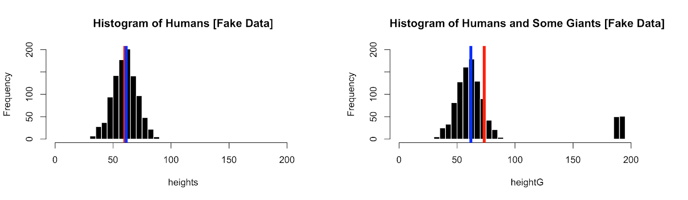
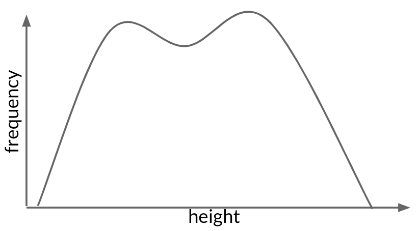
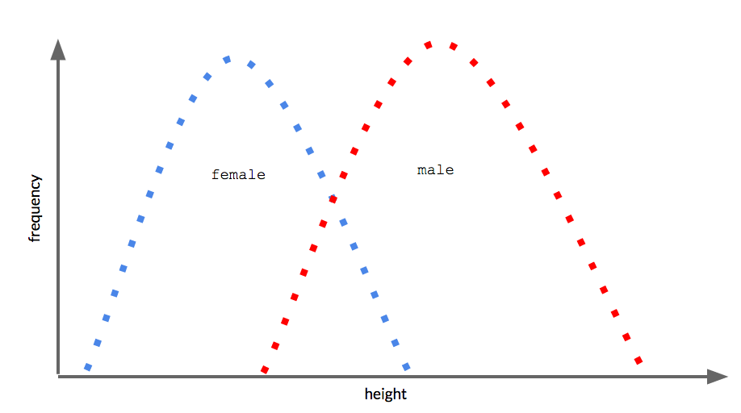
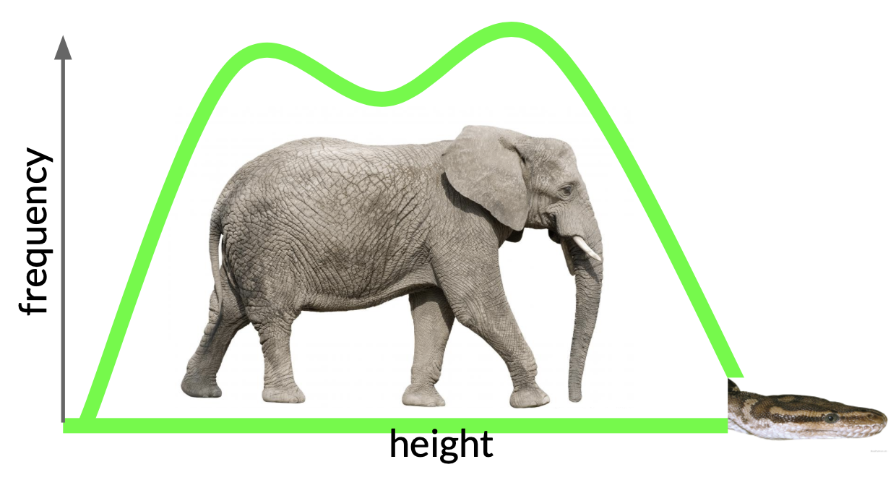
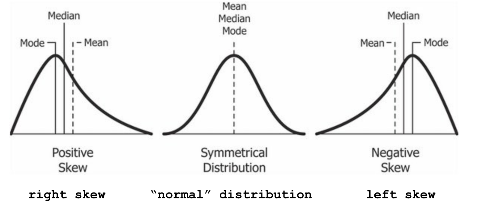
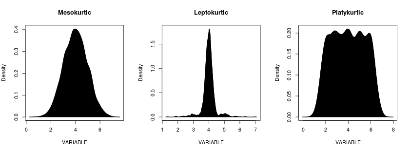

# Describing Data

{fig-align="center"}

::: callout-important
## Who Cares?

This week, you’ll learn how to use statistics to describe data in terms of centrality and complexity (and review how the mean and standard deviation can be thought of as prediction and error).

- **Part 1** Describes the mean in terms of prediction, and the standard deviation in terms of error.
- **Part 2** Reviews how to calculate statistics in R.

**By the end of this chapter :** calculate descriptive statistics for numeric variables in the dataset, and interpret these statistics to help explain why we should care and other questions we might explore about this variable.
:::

# Part 1 : Descriptive Statistics (We are Different, We are the Same)

We use statistics as a language to describe how individuals are similar to each other ("Centrality"), and how individuals are different from each other ("Complexity").

## Centrality

You can think of *centrality* as a summary of the data that describes some "core aspect" of a variable, while also reducing some of the important complexity. While a lot of information is lost in a summary (e.g., Lord of the Rings is much more about some Hobbits trying to destroy an evil ring), a summary often gets the key points across in few words (e.g., Lord of the Rings does spend a lot of time describing Hobbits trying to destroy an evil ring.)

### The Mean

#### Definition.

The mean (also known as the average) is one of the most important statistics, and the foundation for much of what we will do in this class.

You probably learned this equation as something like, “add up all the numbers and divide by the total number of numbers”. This is technically correct, but scientists like to be more specific and formal, and so statistics uses a more specific language.

The statistical equation for the mean is below; it may look confusing, but it is really just a fancy version of the same definition of the mean you know and love. Specifically, the formula defines the mean as “equal to the sum of all individual x-values (starting with the first individual and ending with the last individual in the dataset), and divided by the sample size.”

+-------------------------------------------------+-------------------------------------------------------------------------------------------------------------------------------+
| The Equation                                    | Breakdown of Terminology                                                                                                      |
+=================================================+===============================================================================================================================+
| $$\Large \bar{y} = \frac{\sum_{i=1}^n y_i}{n}$$ | - $\bar{y}$ = "y bar" = the mean of y                                                                                         |
|                                                 | - $\Sigma$ = Sigma = the "sum" of numbers (starting from the number on the bottom all the way through the number on the top). |
|                                                 | - $i$ = index = an individual                                                                                                 |
|                                                 | - $n$ = sample size = the number of individuals in the dataset                                                                |
|                                                 | - $y$ = a variable                                                                                                            |
+-------------------------------------------------+-------------------------------------------------------------------------------------------------------------------------------+

So, when reading this formula, you would "say" : "y bar (the mean) is equal to the sum of all individuals of y ($y_i$) starting with the first ($i=1$) and going all the way through the total number of individuals ($n$). And then you take that sum, and divide by the total number of individuals ($n$).

See?! Simple!

#### Why It Matters.

One important characteristic of the mean is that it is the value of a distribution that is closest to all the other scores. This means that the mean serves as our “best guess” (a prediction) about the value of what any random individual scores in this distribution. This is why the mean is also called the ‘expected value’.

You've internalized this in many ways :

- Imagine you take an exam, and the professor tells you the average score is a 95/100. You and the other students in the class likely would feel relief, even though you don't know your exact score, because you are making a prediction about your individual score based on the mean. In other words, you are using the mean to give you knowledge about your scores.

- If you know the average temperature for summer in the Bay Area is a high of 70 degrees and a low of 56, then you can predict on any given day that you might need a sweater in the morning and evening, but will be hot in the afternoon.

HOWEVER - the mean does not perfectly describe all scores in the distribution (because people are complex - we are not the same). We’ll talk more about these “errors” in prediction when we talk about the standard deviation (a measure of complexity) below.

### The Median

#### The Definition

The **median** is the value that is in the very *middle* of a distribution of scores. This means that 50% of scores in the distribution are higher than the median value, and 50% of the scores are lower than the median value.  If there’s an odd set of numbers, the median is the middle number. If there’s an even set of numbers, the median is the average of the two middle numbers. 

So imagine two sets of numbers : what number is in the very middle?

- 2, 3, 3, 5, 10, 14, 19
- 2, 2, 3, 3, 5, 10, 14, 19

::: {.callout-tip collapse="true"}
#### Activity : What's the median?

- 2, 3, 3, 5, 10, 14, 19 = the median value is 5, since this number is in the middle. note that when calculating the median, the values of the data should be organized from smallest to larges.

- 2, 2, 3, 3, 5, 10, 14, 19 = the median value is 4; since there is no "true" middle, 4 is the value that is in the middle of the two nearest values 3 and 5.
:::

#### Why It Matters

Because the median is defined entirely by the middle of a distribution, it is less influenced by extreme data (outliers) than the mean. The median can be useful then when a few extreme scores might overly influence the mean in ways that might be misleading about what "most" people are like.

For exampe, below are two graphs of height. The one on the left is for a collection of people, and the histogram on the right is a graph of heights for a collection of people and some big friendly giants. The median of this distribution is illustrated as a vertical blue line, and the mean of this distribution is illustrated as a vertical red line.

Which statistic seems like a better summary of the distribution of heights on the right to you?

{fig-align="center"}

::: {.callout-tip collapse="true"}
#### Activity : Is the Mean or Median a Better "Summary" of the Height Data?

- The mean (red line) better represents information about the giants, who are a relevant and important part of our dataset.

- However the median better summarizes what's going on with most of the data in the distribution.

- Both statistics are relevant depending on what feature you want to focus on, and the fact that the median is higher than the mean is an important indicator that there are some outliers (or skew - see below!) in the distribution.

- You can report both the mean and median as a researcher when relevant. However, the mean is more central to the predictive statistics that we will learn later in this class.
:::

### The Mode

#### The Definition

The **mode** is the most common number in a set of numbers. If two numbers are equally common in a distribution, then the distribution is said to be bi-modal (and more than two most common numbers = multimodal)

So if your distribution was : 2, 3, 3, 5, 10, 14, 19, 20, 20, then the mode would be…[^1]

[^1]: the mode would be 3 and 20, since these are the most frequent

#### Why It Matters

The mode is rarely reported in research articles - I sometimes see it in within-person studies, or in situations where researchers are measuring psychophysiological measures (like heart rate or vagal tone) where the peak of the distribution might indicate something important.

Conceptually, it can be interesting to note the presence of a mode, and to think about why a bi-modal (or multi-modal) distribution occurs. 

For example, look at the following illustration : why might this bimodal distribution occur?

::: {.callout-tip collapse="true"}
### Reasons for this bimodal distribution.

+------------------------------------------------------------------------------------------------------------------------------------------------------------------------------+-------------------------------------------------------------------------------------------------+
|                                                                                                                                                                              |                                                                                                 |
+==============================================================================================================================================================================+=================================================================================================+
| The more conventional answer is that this bimodal distribution represents overlap between male and females in a dataset of heights collected from cis-gendered participants. | Another possibility is that this graph illustrates a python who has swallowed an elephant.[^2]\ |
|                                                                                                                                                                              |                                                                                                 |
|                                                                                                                                               |                                                                   |
+------------------------------------------------------------------------------------------------------------------------------------------------------------------------------+-------------------------------------------------------------------------------------------------+
:::

[^2]: see Antoine de Saint-Exupéry’s (1943). The Little Prince.

## Complexity

Complexity refers to the ways that data differ from each other - really the focus of variation. And yet, as scientists, we are trying to understand patterns in that variation, and so have developed a language to talk about some of the systematic ways that individuals differ.

### Range.

#### Definition.

One way people differ is by the extreme ends; this is called **the range**. Most people refer to the range as the lowest and highest value; though sometimes the range is defined as the distance between the highest and lowest value.

#### Why It Matters.

The extreme low and high of your variable give you a sense about the limits of variation. How to interpret these limits really depends on the variable you are measuring; for a variable like reaction time in some cognitive task, I would expect the low end to be zero (or something near zero, but not negative) and the high end influenced by how long I would expect the task to take (usually anywhere from less than a second for a quick reaction to a few minutes.) If the high end of the range was something like 30-minutes, I would think that something went wrong.

As a researcher (and teacher) I often use the range as a quick way to ensure the data are correct - that is, to confirm that the lowest and highest scores are possible values given the way the variable was measured. For example, I check the range when looking at test scores to make sure no students got a negative score or score above 100% (both impossible in my class.)

### Skew.

#### Definition.

Skew describes asymmetry in the shape of the distribution. A graph that is symmetrical has no skew.

{fig-align="center"}

It’s easy to confuse the different types of skew, so I like to think of skew as a type of pokemon (“pikaskew”), where the direction of skewness is defined by its tail, since Pokemon (at least the ones I can think of) have tails. This is my trick; feel free to use it (you are welcome) or develop your own! 

**skew → pikachu →** {width="102"}**--\> tail**

#### Why It Matters.

Thinking about skew can help guide thoughts about why people differ.

- **Negative Skew (also called “Left Skew”)** is when the distribution “tail” sticks out on the negative (low) end of the measure. A negatively skewed distribution means that there’s a greater probability of high scores than low scores, and can be explained by ceiling effects (a measure does not differentiate between high scorers - like an exam that almost everybody aces because you were all prepared.)

- **Positive Skew (also called "Right Skew")** is when the distribution “tail” sticks out on the positive (high) end of the measure. A positively skewed distribution means that there’s a greater probability of low scores than positive scores, and can be explained by floor effects (a measure does not differentiate between low scorers).

- **No Skew (also called the "Normal" Distribution)** is when the distribution is symmetrical. You'll learn more about "Normal" Distributions in Chapter 4.

### Kurtosis

Kurtosis describes the size of the tails, relative to the middle of the distribution. I think of kurtosis as the pointiness of the distribution. Mesokurtic is a distribution that looks “normal”, leptokurtic is a distribution that is skinny in the middle (with many individual scores in the tail of the distribution), and platykurtic is a distribution wide in the middle with few observations in the tails.

{fig-align="center"}

Like skew, there are ways to quantify kurtosis, but we won’t cover this in the class. I almost never see kurtosis reported as a statistic.

## The Standard Deviation : A Mix of Centrality and Complexity

### The Definition

The standard deviation (*sd*) is a way to quantify the ‘average’ variation in your dataset. More specifically, it is the average distance between all individual data points in the distribution, and the mean of the distribution. These distances (between an individual score and our prediction) are called residuals.

The standard deviation is always positive, since it describes the average distance of individual scores from the mean (residuals), and not whether those residuals are above or below the mean. A standard deviation of zero means there is no variation - all scores in the distribution are the same. The larger the standard deviation, the more variation there is in the data. There’s no limit to how large the standard deviation might be.

Understanding what the standard deviation is, and how it's calculated, is a critical skill. In the videos below I walk through how to calculate standard deviation by “hand”. You will never actually use this approach in real-life, but I find it very helpful to fully understand what a standard deviation is, and how (and why) we use residual scores in statistics.

With the chickenweights dataset, of course.

#### Video : The Mean as Prediction

With no other knowledge about an individual, the mean is our best prediction about what an individual is like.



#### Video : Residuals as Error

**Residuals** refer to the fact that the mean is not a perfect prediction for every person; people will differ from our predictions. These differences between each individual's actual score and our predicted value (in this case, the mean) are called residuals.

**The residuals will always be actual score minus prediction - I remember this because as researchers we care about actual people first.**



#### Video : The Sum of (Squared) Residual Errors

**The sum of squared errors (SS)** is a way to quantify the total residuals when using the mean to make predictions. As you'll see in the video, we must first square the residual differences in order to remove the direction (since we care about the total error, not whether the individual was above or below our prediction.). And then we sum these squared differences to quantify the total (squared error).



#### Video : The (Unsquared) Average of These Squared Residuals = Standard Deviation

**The standard deviation** is the squared root of these averaged squared differences. Or, in less technical terms, the standard deviation is the average of how much people differ from the mean - a measure of the average variation.



### Why This Matters

Great question! Quantifying the residuals and the standard deviation does two things :

1.  **The standard deviation quantifies how much the "average" person differs from the average of the individuals.** This is a great statistic to have, since it quantifies how much individuals differ from each other on average (a way to quantify between-person variation when the individuals are different people). Note that the standard deviation can also be used to quantify within-person variation when the "individuals" are scores measured from the same person.
2.  **Quantifying our residuals helps us understand .** The mean is a GREAT starting place for our predictions, but soon we will want to make more sophisticated predictions. We will do this with our good friend *the linear model (see Chapter 6)*, and will know whether we can improve our predictions by decreasing the amount of residual error.

# Part 2 : Describing Data in R

## R Code : Descriptive Statistics

Below is a list of code we'll use to calculate descriptive statistics in R.

+-----------------------------------+--------------------------------------------------------------------------------------------------------------------------------------------------------------------------------------------------------------------------------------------+
|                                   |                                                                                                                                                                                                                                            |
+===================================+============================================================================================================================================================================================================================================+
| **R Command**                     | **What It Does**                                                                                                                                                                                                                           |
+-----------------------------------+--------------------------------------------------------------------------------------------------------------------------------------------------------------------------------------------------------------------------------------------+
| `summary(dat)`                    | Reports descriptive statistics for all variables in the dataset.                                                                                                                                                                           |
+-----------------------------------+--------------------------------------------------------------------------------------------------------------------------------------------------------------------------------------------------------------------------------------------+
| `summary(dat$variable)`           | Reports descriptive statistics for a continuous variable.                                                                                                                                                                                  |
|                                   |                                                                                                                                                                                                                                            |
|                                   | Reports frequency for a categorical variable.                                                                                                                                                                                              |
+-----------------------------------+--------------------------------------------------------------------------------------------------------------------------------------------------------------------------------------------------------------------------------------------+
| `mean(dat$variable, na.rm = T)`   | Reports the mean (average) of a variable; you must include the na.rm = T argument if there is missing data (otherwise R will return NA as the result).                                                                                     |
+-----------------------------------+--------------------------------------------------------------------------------------------------------------------------------------------------------------------------------------------------------------------------------------------+
| `median(dat$variable, na.rm = T)` | Reports the median (middle point) of a variable.                                                                                                                                                                                           |
+-----------------------------------+--------------------------------------------------------------------------------------------------------------------------------------------------------------------------------------------------------------------------------------------+
| `range(dat$variable, na.rm = T)`  | Reports the lower limit and upper limit of the variable.                                                                                                                                                                                   |
+-----------------------------------+--------------------------------------------------------------------------------------------------------------------------------------------------------------------------------------------------------------------------------------------+
| `sd(dat$variable, na.rm = T)`     | Reports the standard deviation of the variable.                                                                                                                                                                                            |
+-----------------------------------+--------------------------------------------------------------------------------------------------------------------------------------------------------------------------------------------------------------------------------------------+
| `hist(dat$variable)`              | Draws a line on a plot or histogram at specified values (e.g., this draws a vertical line at the mean of dat\$variable. You can replace v with h to draw a horizontal line. We will use abline() later in the semester in a different way. |
|                                   |                                                                                                                                                                                                                                            |
| `abline(v =mean(dat$variable))`   |                                                                                                                                                                                                                                            |
+-----------------------------------+--------------------------------------------------------------------------------------------------------------------------------------------------------------------------------------------------------------------------------------------+
| `par(mfrow = c(i, j))`            | Splits your graphics window into i rows and j columns (replace i and j with numbers)                                                                                                                                                       |
+-----------------------------------+--------------------------------------------------------------------------------------------------------------------------------------------------------------------------------------------------------------------------------------------+

## Video : Describing Happiness (World Happiness Report)

In this video, I walk through loading the a version of the World Happiness Report and describing and graphing the happiness variable. NOTE : the dataset that you have access to in the "Chapter Dataset" folder is a slightly different version of the dataset I'm using in these videos...apologies for the confusion! I will try to re-record the video and update this soon :)



## Video : Standard Deviation of Happiness (World Happiness Report)

In this video, I review how to calculate the standard deviation, and what this statistic tells you about the variable happiness.



## [Practice Quiz with R](https://docs.google.com/forms/d/e/1FAIpQLScJ2ZvwLv2D4SYXFN2NL-7M8-B3Acq9BXsS1HwJSPf-LnGx4w/viewform?usp=sf_link) : Practice Chapter 3 Quiz (Describing Variables)

**Instructions**

Use R and the twitter_emotion_data.csv to answer the following questions in the check-in above.

- Here's a [**link to the dataset**](https://www.dropbox.com/scl/fi/zye2fojtmol8wdmd1gfb7/twitter_emotion_data.csv?rlkey=t728np5edvmw3wjoorj2hddwu&dl=0) (load this into R) and a [link to the Codebook](https://www.dropbox.com/scl/fi/0q0meai7hawk4oexw948c/CODEBOOK-_-Twitter-Emotion-Dataset.pdf?rlkey=yz6aiqtow6k4ey16k8qd0y4yz&dl=0) (that describes the dataset)

- [**Link to a video key**](https://youtu.be/L3kQXfp2jNg)**;** but good to try this on your own!

**Questions**

1.  Load the data and check to make sure the data loaded correctly. How many individuals (tweets; in this dataset, each row = one tweet) are in the dataset?

2.  Graph the variable retweet_count. How would you describe the shape of this variable?

3.  What do you learn about the variable retweet_count from this graph?

4.  What is the mean of the variable retweet_count?

5.  What is the median of the variable retweet_count?

6.  What is the standard deviation of the variable retweet_count? \[note : you do not need to do this by hand\]?

7.  What is the lowest value (range) of the variable retweet_count?

8.  What is the highest value (range) of the variable retweet_count?

9.  Now, work with the categorical variable Orientation. How many Liberal (tweets) are in the dataset?

10. How many Conservative (tweets) are in the dataset?

# TLDR.

We learned how to describe variables in terms of consistency (e.g., mean, median) and complexity (e.g., range, standard deviation). We focused on how to define the standard deviation, and then looked at how to do this in R.

Next week in lecture, we will continue to learn to use R, statistics, and our human brains to describe and understand how people differ.
