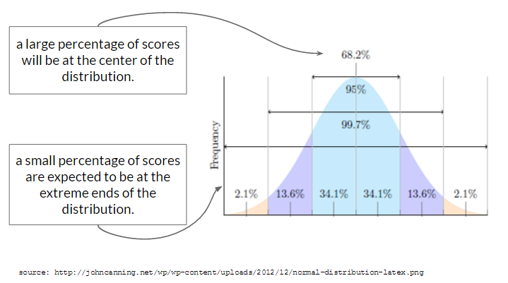
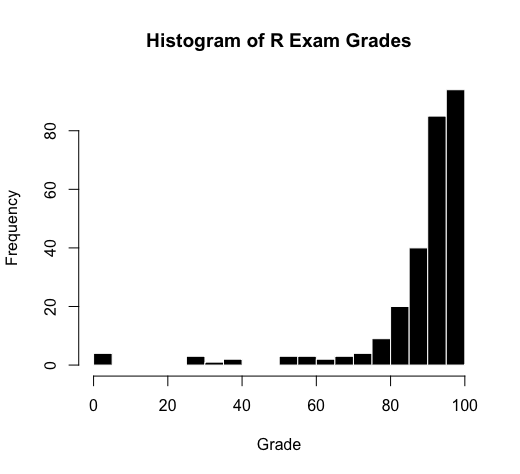
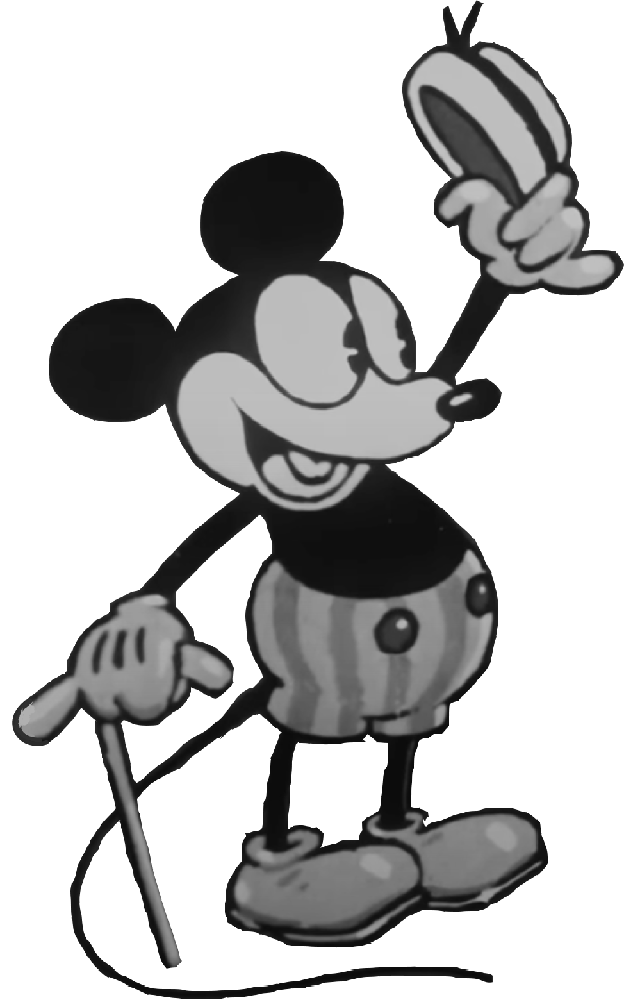

# "Normal" Data


The image above depicts [*Grounded in the Stars*](https://www.thomasjprice.com/times-square-arts), a 12-foot sculpture of a young woman that stood in New York City's Times Square from April 29 through June 14, 2025.

::: callout-important
## Who Cares?

In this chapter, you’ll learn how to define, discuss, and critique the idea of "normality" and "deviance".

- **Part 1** reviews the "normal" distribution, why social scientists often see this type of distribution, and some of the reasons why scientists do not always see this type of distribution.
- **Part 2** discusses how to quantify deviation from the mean in R, identify outliers, and remove them using R.

**By the end of this chapter :** you will be able to express how and why data differ from the mean, and remove outliers in R.
:::

There's a lot that I love about the image at the top of this chapter, from the artistry of rendering braids and clothes so naturally in sculpted bronze, to the way the character stares off in the distance as if unconcerned with the gaze of others, to the way the sculpture proudly claims space in a society that does not currently and historically create inclusive spaces for black women. Indeed, the sculpture is surrounded by other massive images\[\^4r_normalpeople-1\] whose presence in the space may go unnoticed because it is so routine to see images of white men in public places. \[\^4r_normalpeople-1\]: Tom Cruise and some eyeglass model who kind of looks like a 90s era Tom Cruise. Ving Rhames is there too if you look closely enough.

The artist's website emphasizes the way the sculpture challenges pre-existing ideas about who is represented in our society, and references Michelangelo's *David* as inspiration, but clarifies that this sculpture is "A fictionalized character constructed from images, observations, and open calls spanning between Los Angeles and London" who "carries familiar qualities, from her stance and countenance to her everyday clothing."

This statue, and the fact that it was an amalgamation of real people, also reminded me of the sculptures of "Normmann" and Norma.

{fig-align="center" width="80%"}

Like the unnamed woman in Times Square who was the subject of *Grounded in the Stars,* Normmann and Norma's measurements were based on composites of other people; in Norma's case "the averaged measurements of 'native white' American women recorded and standardized by the Bureau of Home Economics in 1940, in an attempt to devise the first standardized system of sizing for ready-made clothes."[^4r_normalpeople-1]

[^4r_normalpeople-1]: For a more in-depth history of Norma and Normann, including critiques of the gender and post-WW2 contexts in which these statues arose, See Chapter 8 of Peter Cryle & and Elizabeth Stephens' *Normality: A Critical Genealogy*. University of Chicago Press, 2017.Chicago Scholarship Online, 2018. [https://doi.org/10.7208/chicago/9780226484198.001.0001](#0).

Unlike the subject of *Grounded in the Stars,* Norma and Normmann were based on different demographic data. More important, these characters were labeled and advertised as "The Typical American". A type of person who reflected and reinforced the values that white America wanted to promote.

Indeed, these statues achieved their purpose in various ways; Norma and Normman were first displayed in the American Museum of Natural History during the International Congresses of Eugenics in 1945. Furthermore, when the statues were gifted to the Cleveland Health Museum, the museum held a contest to find the woman who most typically represented Norma[^4r_normalpeople-2], offering prize money in "a search for Norma, the typical American woman". While a winner was selected, the search failed in the original efforts to find someone who *perfectly* matched this average, as the measurements of the winner “did not coincide with those of the statue. . . . after assessment of the measurements of 3,863 women who entered the search, Norma remained a hypothetical individual.”[^4r_normalpeople-3]

[^4r_normalpeople-2]: I'm not entirely sure why Normann was not subject to a similar contest, though my guess is that it's a symptom of a patriarchy that perpetuates the male gaze in [many ways](https://www.youtube.com/watch?v=ulsjuiFO2J0).

[^4r_normalpeople-3]: Josephine Robertson, “Theatre Cashier, 23, Wins Title of ‘Norma,’ Besting 3,863 Entries,” Cleveland Plain Dealer, September 23, 1945, 1.

Here, we see a few course themes that we will discuss in this chapter, and in this week's lecture :

- What is "normal" and who gets to define this term?

- What are the alternatives to "normality"? How are these alternatives labeled?

- What is the point of labeling individuals as normal?

# Part 1. Defining and Critiquing "Normality"

## The "Normal" Distribution.

The “Normal” (or Gaussian) distribution is a common shape for what distributions of data look like. The shape is often called a “bell curve”, because it looks like the curve of a bell. Ding.

While many distributions appear normal, the “Normal Distribution” ™ refers to a distribution that describes an expected probability of a range of scores.

{fig-align="center"}

The Normal Distribution is called "normal", in part, because researchers expect to see this type of distribution for variables where two conditions are met:

1.  **There are multiple explanations for why the variation occurs**. This happens very frequently across all science, since life is complex and there are many reasons why individuals differ.
2.  **These multiple explanations occur independently**. "Independence" means that one explanation for variation is unrelated to the presence of another explanation for variation. For example, your height is somewhat influenced by your genetics (you are likely similar height to your family members) and your diet (i.e., whether you got enough nutrients in childhood or not), but your diet is likely unrelated to your genetics. Non-independence might mean that there is some shared experience among individuals that is influencing their variation in predictable ways. For example, children who were exposed to all the horrors of war experienced multiple factors that negatively impacted their height - malnutrition, sleep disturbances,

### Example 1 : Thinking About Distributions.

Indeed, many of the variables that psychologists measure do appear "Normal". For example, let’s look at one example "normal" distributions - a "self-esteem" variable. Note that it's not perfectly normal[^4r_normalpeople-4], but it's pretty close and representative of the kind of "real world" data that you might encounter.

[^4r_normalpeople-4]: good not to hold data to unrealistic body images as well as people.

```{r}
#| include: false
d <- read.csv("../datasets/Self-Esteem Dataset/data.csv", stringsAsFactors = T, na.strings = "0", sep = "\t")
SELFES.df <- data.frame(d[,c(1:2,4,6,7)], 5-d[,c(3,5,8:10)])
d$SELFES <- rowMeans(SELFES.df, na.rm = T)
```

```{r}
hist(d$SELFES, col = 'black', bor = 'white', 
     main = "Histogram of Self-Esteem", 
     xlab = "Self-Esteem Score", breaks = 15)
```

**"Independent" explanations for why variation in self-esteem occurs.** Self-esteem is complex, and can be influenced by variables such as: genetics, parental environment, home environment, income, neurotransmitters, whether your crush told you they like you too the day you took the self-esteem survey, etc. These variables are considered independent because one does not influence the other, and they differ across participants in the study. That is, someone who had a happy parental environment may not necessarily have a high income, rich people have their crushes ignore them too, etc.

**"Non-Random" Explanations.** Careful observers will note that self-esteem appears slightly shifted above the mid-point of the scale (which goes from 1-4, so 2.5 would be the mid-point), and that there's some slight negative skew (meaning more individuals are on the higher end of the distribution). It's unclear why there's this shift in the data, but below are a few possible reasons :

- There's some shared cultural experiences among participants - our society values self-esteem, and people might be biased to self-enhance / self-present a higher self-esteem. This is a non-independent influence, since many participants might experience this in our culture that puts pressure on people to have a high self-esteem.

- The sample was biased to include people with higher levels of self-esteem, or maybe people with lower levels of self-esteem were less likely to complete the survey (which hurts their self-esteem because they haven't yet fully internalized that it's okay to be imperfect in a society that demands perfection.) In any case

- The survey was administered on a day when everyone in the world had a really good hair day, so there's a non-independent factor that's shifting many people's self-esteem up.

### Example 2 : Thinking About Distributions.

Below is another example of a distribution - this one is not random, but is skewed (pop quiz : is it positively or negatively skewed? See here for answer[^4r_normalpeople-5].)

[^4r_normalpeople-5]: It is negatively skewed, since the tail is on the negative side of the distribution.

{fig-align="center"}

::: {.callout-tip collapse="true"}
#### "Random" Reasons for Variation

Lots of things can influence a student’s score on an exam, such as how much students were motivated to study, how much time they had to study, what was going on in their lives, whether they had a study buddy in the class, whether they were sick or not on the day of the exam, their “test taking” skills and strategies and anxiety levels, etc.
:::

::: {.callout-tip collapse="true"}
#### "Non-Random" Reasons for Variation.

These data are not normally distributed because the students were all part of the same college, in the same classroom, taught by the same professor, at the same time. The professor did his best to prepare these students, and wrote a test that would be based on the kinds of practice they had gone over in lecture. These variables are considered “non random” because they were shared by all students. The data are skewed because these non-random shared experiences helped students do well on the exam.
:::

### Critical Culture in Statistics

:::: callout-tip
#### The Normal Curve

::: column-margin
[That's right folks, it's time for another chat with your friend Open-Source Mickey Mouse about how statistics has a culture that is socially constructed by people like you!]{.smallcaps}

{width="80%"}
:::

This time, we're gonna chat about the idea that people differ from some average. The idea that you could quantify people as "average" is fairly new - it's hard to pinpoint exactly, but a scientist named Quetelet first extended the statistical methods derived from astronomy to be applied to humans in the 1860s[^4r_normalpeople-6]. Quetelet thought the average was an ideal state since it reflected the center of all possible individuals. However, a few years later Francis Galton used Quetelet's ideas to try and "rank" individuals according to some hierarchy of excellence. For Galton, the average was not an ideal state, but rather something to overcome in a desire for greater and greater excellence. Galton was also a racist and father of the eugenics movement, who used distorted statistics as a tool to justify his own pre-existing racist beliefs that white people were superior to everyone else. Yuck!

I think it's worth the time and space to hear this from Galton himself.

*To conclude, the range of mental power between—I will not say the highest Caucasian and the lowest savage—but between the greatest and least of English intellects, is enormous. ... I propose in this chapter to range men according to their natural abilities, putting them into classes separated by equal degrees of merit, and to show the relative number of individuals included in the several classes.....The method I shall employ for discovering all this, is an application of the very curious theoretical law of “deviation from an average.” First, I will explain the law, and then I will show that the production of natural intellectual gifts comes justly within its scope. -* Galton, Hereditary Genius (1869). [Linked here](https://galton.org/books/hereditary-genius/text/v5/galton-1869-hereditary-genius-v5.htm).

The point of bringing up some of the racist origins of statistics is two-fold :

1.  Many people like to argue that "good" statistics is objective, and that scientists are free of bias. So it's important to acknowledge that the inventors of many statistics that we use had clear biases and did not behave objectively. Rather than try to be free of bias, I think it's important to acknowledge where and when people are biased, and address those biases up explicitly.
2.  Statistics is a tool, and that tool can be used poorly and dangerously in ways that can cause a lot of pain. Just because something has numbers doens't mean it's correct. For example, Galton's work showing "statistically" that white people were superior in ability to other groups didn't account for other factors like socioeconomic status. And for what it's worth, modern scientists overwhelmingly agree that "race" is a social construct. There are genetic differences that explain different skin tones, however there is more genetic variation in skin tone within a similar “race” than between different “races”. [Read more about this here.](https://www.smithsonianmag.com/smart-news/genetic-study-shows-skin-color-just-skin-deep-180965261/)

Alright, that's all for now! Let me know what you think and see you next time!
::::

[^4r_normalpeople-6]: see Rose's END OF AVERAGE (2016) or, for a more critical approach, Chapman's (2023) EMPIRE OF NORMALITY.

### Why This Matters.

The normal distribution is foundational to the statistics we will learn in this class. (And in an advanced statistics class, you'll learn how to adapt techniques if you want to understand non-normal distributions.)

This does not mean that every variable needs to be normally distributed; we'll work with skewed variables and categorical variables (which have their own distributions) in lots of ways. However, the "normal distribution" is an important reference point that we can use to evaluate variables. For example, I see (and hope) that exam scores will be *negatively skewed* because they differ from the normal distribution in a systematic way - I want most students to do really well on the exam, but also understand that a few may struggle for a variety of reasons (things in their life going on that take away from their ability to focus or spend time in the class, past math or stats or computer trauma, lack of experiences, really not vibing with me or the class, got addicted to playing Civilization 5 or catching Pokemon or learning to play the mandolin...etc.)

## Outliers : When People Differ from "Normal"

### The Definition

Outliers are extreme values that are so different from the rest of the data that you remove them from the dataset because you worry that they might cause problems for your data. Outliers exist because of errors in data entry (for example, the person who lists their age as 1009 instead of 19) or because they represent individuals who are qualitatively different from the rest of your data (for example, the participant who is a billionaire and lists that as their income.[^4r_normalpeople-7])

[^4r_normalpeople-7]: No shame billionaires! You are just very different from the rest of us. Let us know if I can hang out on your yacht? You belong to an understudied group and I have some research ideas. kthxbye.

How extreme is too extreme? Some folks like to come up with rules for making this decision based on the number of standard deviations away from the mean or some other metric. I appreciate those efforts, but personally believe it’s better to judge outliers based on the qualitative decisions above (and use past research as a guide). Whatever you do, make sure to (1) justify your decisions, (2) report these decisions in your code and analyses, and (3) make any decisions about removing outliers as early as possible and before you start making predictions.

### Why It Matters.

The presence of outliers in your data has the potential to influence your results in ways that will bias your results. For example, if someone wandered off in the middle of a cognitive task, their outliers for reaction time might make you think people took way longer to complete the task than people really needed to take. If I included everyone who didn't take the exam (and got a zero) in taking the average of the exam score, I might think that students did worse on the exam than they really did, when I should have excluded these zeros to get a better representation of how people did on the exam.

It's therefore super critical to a) identify any possible outliers in the data, and b) remove them from data analysis, and c) be 100% transparent that you have removed data. You will learn to do this using R in Part 2 below.

## The Z-Score : Okay, but I want to quantify *exactly* how much a person is an outlier!

### Z-Score : Definition

The z-score is a linear transformation[^4r_normalpeople-8] that calculates the distance of an individual score (${y_i}$) from the mean ($\hat{y}$) in units of standard deviation ${\sigma_y}$.

[^4r_normalpeople-8]: A linear transformation means that the order and spacing of the data are unchanged - the person who has the highest self-esteem when measured on a 0 to 4 scale will still have the highest z-score, and be the same distance away from the next highest individual.

$$\huge z = \frac{y_i - \hat{y}}{\sigma_y}$$

Each individual score in the dataset can be z-scored, and this statistic tells you how far above or below the individual is from others (the mean), relative to the average difference from the means (which is what the standard deviation describes.)

Z-scoring changes the units of the variable from the original unit of measurement, to units of standard deviation.

- A z-score of 1 means that the individual is 1 standard deviation above the mean (about as different as average).

- A z-score of 0 means that the individual is EXACTLY the mean.

- A z-score of -4.112 means that the individual is over 4 standard deviations below the mean; which is VERY below average.

- A z-score of .01 means the person is just a tiiiiny bit above the mean.

### Z-Score : Some Examples (using R)

You can see first few "Raw" and "Z-Scores" from the self-esteem dataset below.

```{r}
#| echo: false
head(data.frame("Raw Scores" = d$SELFES, "Z-Scores" = scale(d$SELFES)))
```

There are two ways of calculating the z-scores:

1.  **Using the `scale()` function.** This function calculates the mean and standard deviation of an object, and then uses these statistics to calculate the z-score for the data.

    ```{r}
    d$SELFES_Z <- scale(d$SELFES)
    d$SELFES_Z[1:5]
    ```

    - Note that the \[1:5\] index is not needed for z-scoring, and is just helping me only show the first five elements.

2.  **You can also manually calculate a z-score.** But don't do this by hand. I mean you could, but you could also do this with a pencil and that's not needed anymore.

    ```{r}
    zSELF <- (d$SELFES - mean(d$SELFES, na.rm = T)) / # distance from the mean, divided by....
              sd(d$SELFES, na.rm = T) # the standard deviation
    zSELF[1:5] # just showing the first 10 z-scored variables.
    ```

### Z-Score : Who Cares?

A z-score can be useful for two reasons :

1.  **It removes the units of measurement.** Many variables in psychology are measured with likert scales, or other made up numbers that don't have a shared meaning, but are instead meant to rank or sort individuals along some spectrum. For example, I don't really know what to do with the knowledge that a person 3 in the dataset has a self-esteem score of `r d$SELFES[3]` . But knowing that this person's z-score is `r zSELF[3]` tells me that their self-esteem is lower than average, but only a little lower than the average.
2.  **It emphasizes the individual's rank within the distribution.** If you know a job at Amazon dot com is offering 5187 BEZOS BUCKS, you may not know whether this is a high or low paying job among other jobs at Amazon dot com. But if you know the salary of this job has a z-score of .34, you know that this job is higher than average, but only a little higher.

### In Practice : Using Z-Scores to Make Decisions About Outliers

If we look at the variable age from the same self-esteem dataset, we see some issues.

```{r}
hist(d$age)
```

This looks wrong. R says this is a histogram, but it doesn't look like the histograms we've seen before for a few reasons :

1.  **Why does the x-axis go so far to the right?** There are extreme outliers in the variable age - most likley due to errors in data entry - that are way out to the right on the x-axis.
2.  **What are those numbers on the x-axis!?** These outliers are so extreme, that R is reporting the values of age using exponents. 5e+08 means 5 \* 10\^8 = 5 \* 10 \* 10 \* 10 \* 10 \* 10 \* 10 \* 10 \* 10 = 500,000,000 = 500 million. Whew!
3.  **But where are these outliers on the graph? It doesn't look like there's anything there?** The dataset is so large (tens of thousands of people appear to have ages that are closer to zero years old than 500 million years old) that the individual outliers are not registering on the graph. But they exist, and we can use R to find them.

```{r}
d$age[d$age > 100 & !is.na(d$age)]
```

In this code, I'm using indexing \[\] to ask R to find two things :

- `d$age > 120` asks R to find the rows from the dataset d that contain ages that are greater than 100 years old.

- **`!is.na(d$age)`** asks R to find the rows where age is NOT and NA values (the ! when used in coding means "not"). You don't strictly need this code, but it made the output easier to read by removing all the NA values that I don't care about right now.

- the `&` sign in between these commands asks R to find individuals where both conditions are met. You can also use the `|` bar[^4r_normalpeople-9] to ask R to find individuals where EITHER condition is met.

[^4r_normalpeople-9]: the bar can be typed by hitting shift + the key above your return or enter key on the keyboard.

I see that some of the ages were entered in as the year of birth; others look like maybe errors in data entry or jokes (e.g., 90210) and someone entered in an extreme value of 2147483647 that is contributing to our strange graph, and throwing off the mean (but not the median, since it, as we all remember from Chapter 3, is less sensitive to outliers.)

```{r}
mean(d$age, na.rm = T)
median(d$age, na.rm = T)
```

### Side Quest : Removing Outliers Without Z-Scoring

So let's remove these outliers, and check to see that R did this correctly.

```{r}
d$age[d$age > 100 & !is.na(d$age)] # finds the outliers
d$age[d$age > 100 & !is.na(d$age)] <- NA # replaces the outliers with NA
hist(d$age) # my graph.
```

This looks better, but now I see that there are some suspiciously young ages.

So I'll adapt my code to look for individuals who are less than 18 years old.

```{r}
min(d$age, na.rm = T)
youngfolk <- d$age[d$age < 18 & !is.na(d$age)] 
youngfolk[1:100] # just the first 100 folks less than 18
```

I see a lot of teenagers, and some young kids, and even an individual who is reporting their age as 1. And while it could be interesting to look at the narcissism levels of teenagers (and Freud wrote a brilliant if slightly deranged chapter on baby narcissism in [Civilization and Its Discontents](https://www.stephenhicks.org/wp-content/uploads/2015/10/FreudS-CIVILIZATION-AND-ITS-DISCONTENTS-text-final.pdf)), I'm going to avoid any CPHS violations (which treats minors as vulnerable populations) and invoking the wrath of the THE YOUTH who ARE OUR FUTURE, and go ahead and remove these people from the dataset too.

```{r}
d$age[d$age < 18 & !is.na(d$age)] <- NA
```

And now I have much clearer view of the variable age, and a more representative mean and standard deviation of age.

```{r}
hist(d$age, xlim = c(15,100), breaks = 30, main = "Histogram of Age (Outliers Removed)", xlab = "Age (in years)")
mean(d$age, na.rm = T)
sd(d$age, na.rm = T)
```

### Okay, back to using z-scoring.

Looking at the graph, I'm not sure that 100 was the best cut-off for age. There are only a few people between the ages of 80-100, and I'm wondering whether they should actually be included in the dataset.

```{r}
d$age[d$age > 80 & !is.na(d$age)]
```

Here's where a z-score could be useful. Are these elders radically different from our distribution? Let's see how far they are away from the mean of age in units of standard deviation![^4r_normalpeople-10]

[^4r_normalpeople-10]: In the code below, I'm calculating the z-score of age, and defining this as ageZ. But I'm using the original variable - age - to define my rules inside of the bracket.

```{r}
d$ageZ <- scale(d$age)
d$ageZ[d$age > 80 & !is.na(d$age)]

```

I see that all of these ages are very more than four standard deviations away from the average - this is very different from average. In a "normal" distribution, the vast majority of other data would be expected to fall below these z-scores. I can look this up with the `pnorm()` function, which calculates the probability of a score falling below a given z-score (what's called the "lower tail" of the distribution. You can also use this function to find the upper tail by changing one of the arguments.)

```{r}
pnorm(d$ageZ[d$age > 80 & !is.na(d$age)]) * 100
pnorm(d$ageZ[d$age > 80 & !is.na(d$age)])
```

So, if 99.99963% of other scores are expected to fall below an age that is 4.48 standard deviations above the mean (which is the z-score for an 85 year old person in this dataset), then it seems like the 85 year old person is radically different from the rest, and could be excluded.

Some people like to define "rules" for excluding data; things like 3x the standard deviation, or 4x the standard deviation. I'm not a huge fan of these rules, since I think they ignore important context for variables, and are hard to always apply (for example, the teenagers in the dataset are within 3 standard deviations, but I still think they could and should be excluded.) It's best to try and see what the standards in a particular field are, try to make decisions about outlier removal before you collect the data (something called pre-registration, which we will learn about later), document these changes (in your R code), and then be prepared to make different decisions when someone reviewing your research (like an advisor or journal editor) asks you to do something different.

# Part 2. Outliers and Z-Scoring in R

## Some Conceptual Videos

First, a few conceputal videos to reinforce the ideas from Part 1 above :)

### VIDEO : Z-Scores

Here's a video I recorded a few years ago on z-scores.



### VIDEO : Removing Obvious Outliers in R

The video below describes how to remove outliers, using a dataset built into R.



## The "War" Dataset

The videos below discuss data from the "Intra-State-Wars" dataset in the "Chapters" Folder.

### VIDEO : Introduction to the Dataset, Data Cleaning, and Mean and Median

In the video below, I introduce the dataset, do some data cleaning, and discuss the mean and median.



### VIDEO : Calculating the Standard Deviation and the "Problem" of Outliers

In the video below, I work through calculating the standard deviation, why the outliers are causing problems with the descriptive statistics, and then professor goes on a little tangent about a few different methods on how to address these problems. Note : we won't really cover log-transformations in this chapter (yet! maybe I'll add it at some point but there's already a lot going on.) But let me know if you have questions and I can try to explain point y'all to some other resources.



[Here's a link to the RScript I use in the videos](https://www.dropbox.com/scl/fi/hgl3lne7jvrycf14m93wy/IndividualOutliers.R?rlkey=3izduxnx0i6s6g71nof37detb&dl=0).

## TLDR.

We learned how and why people differ from the mean in a predictable pattern (the "normal distribution"), how to quantify how far people are away from the mean in terms of a z-score, and how to remove outliers when needed.

In the next chapter, we will learn how to make more sophisticated predictions of people using the linear model.
