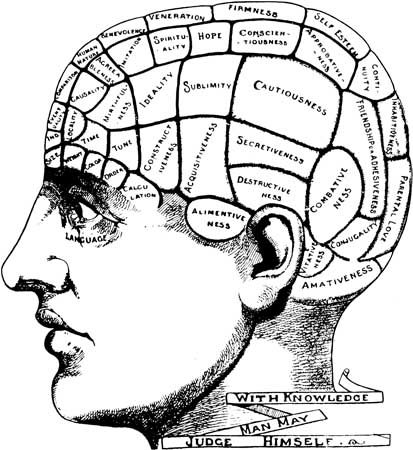
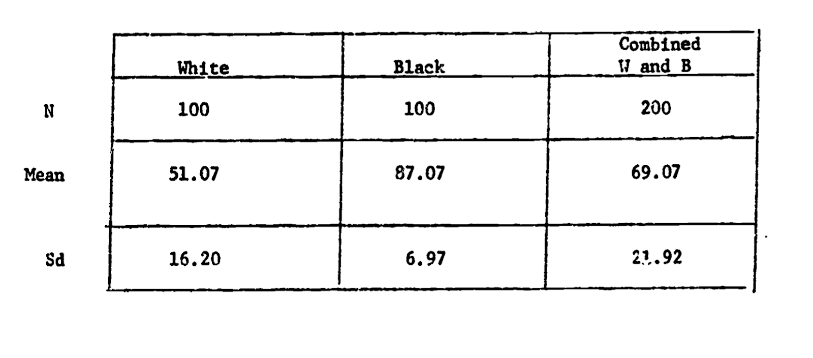
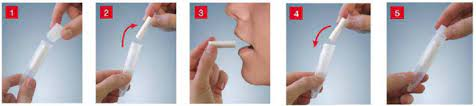
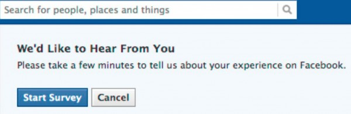
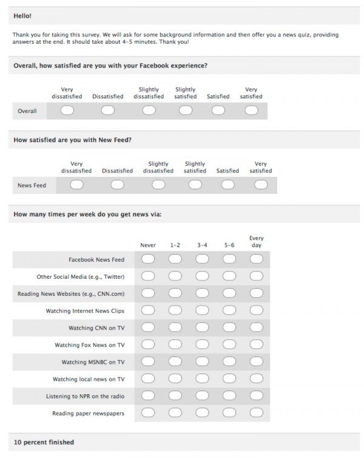
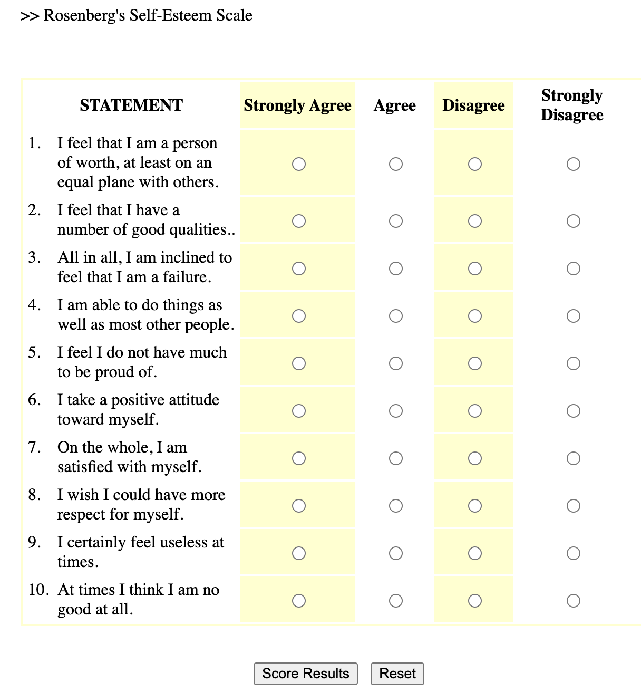
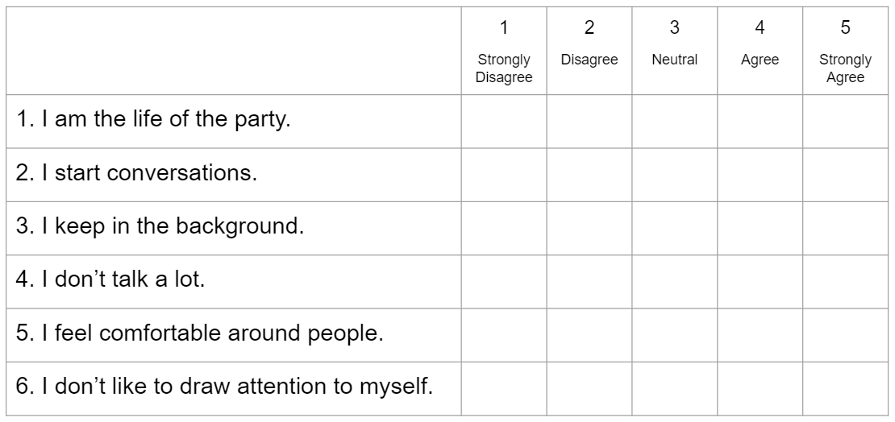

# Good Data

::: callout-important
## In This Chapter

- Learn the different ways that psychologists evaluate the quality of data.

- Learn about the different methods that psychologists use to collect data.

- Learn about how (and why) **likert scales** are used to define continuous variation, and how to create a likert scale in R.
:::


# Part 1 : Good Data (Validity and Reliability)

Scientists evaluate the quality of their measures in terms of **validity** (“truth” or accuracy) and **reliability** (repeatability or precision). Learn more about these two concepts - and their specific forms - in the two videos below.

## Validity and Its Specific Forms

- **Face Validity:** asks us to evaluate whether our measure or result look like what it should look like. This is a superficial (and somewhat subjective) judgment. But it is often a powerful and quick way to assess. For example, if I measure my height and it tells me 100 feet, I know something is wrong because there is no way I'm that tall. Or, when looking at a self-esteem measure, I would want to see items that look like self-esteem questions ("I feel good about myself".) If the self-esteem measure had other questions in it that didn't really seem like they were measuring self-esteem ("I like to look at myself in the mirror") I would have questions about the face-validity of the measure. This seems super obvious, but it's an important check - do the measures used actually look like what they should?

- **Convergent validity:** asks us to evaluate whether our measure similar to related concepts. When two things converge, they come together, and we want our measure to be similar to things that it should be similar to. For example, a measure of body height should be related to a measure of shoe size or tibia length. A measure of self-esteem should be similar to a measure of self-efficacy or satisfaction with life, since both are about how the person is subjectively seeing themselves. They shouldn't be exactly the same thing, but we'd expect to see a pattern in the data. (We'll talk more about how to quantify these patterns when we learn more about linear models.)

- **Discriminant validity:** asks about whether our measure is different from unrelated concepts. When two things diverge, they are different from one another. And we WANT our measure to be different from things that we expect them to be different from. For example, a measure of height should be different from a measure of reading speed or how organized a person is. We would expect self-esteem to be different from how social a person is (though maybe there's some relationship since our society values sociability, and people who are social might get more positive messages from others, bolstering their self-esteem.) This is the hardest concept for students to get, but it's a really important test of the validity of a measure. I not only want my measure to be related to concepts it should be related to, but also different from concepts it should be different from.

## Reliability

- **Test-retest reliability:** asks us to evaluate whether we get the same result if we take multiple measures separated by time. If I think of self-esteem as a stable trait, I should expect to see some similarity in a person's self-esteem at one time point and then the next day. Of course, there will be some change - self-esteem (and other personality variables) can be influenced by the situation and environment. But they shouldn't be radically different if we have a good measure of this core aspect of the self.

- **Inter-rater / Inter-judge reliability:** asks us to evalute whether multiple observers (or tools) make similar measurements. If I have two rulers made by the same company, I would expect them to give me similar answers for how tall I am. Similarly, two different observers who are reliable should make similar jugments about a person's self-esteem, or the number of interruptions they count. If our measure is not reliable, then we might get different answers from the different people (or tools) making the measurement.

- **Inter-item reliability:** When we learned about likert scales, we learned about Cronbach's Alpha - a method of assessing how much the different items in a likert scale were related to each other. This is a form of reliability - specific only to likert scales where we have different questions that are all measuring the same thing. If the scale is reliable, we expect to get similar answers across the different items. For example, someone who says "I feel good about myself" should also say "I feel that I have a number of good qualities."

### Example : Validity and Reliability

Think about a scale. How would you evaluate the validity (face, convergent, discriminant) and reliability (test-retest / interjudge) of a bathroom scale? Think about this on your own, then look over the video key / guide below.

::: {.callout-tip collapse="true"}
### Expand To See Answers

Watch the video below to go over some possible answers, or just look over the table.



+---------------------------------------------------------------------------------------+---------------------------------------------------------------------------------------------------------------------------------------------+
|                                                                                       |                                                                                                                                             |
+=======================================================================================+=============================================================================================================================================+
| **face :** does our measure or result look like what it should look like?             | **high :** I have a sense of what my weight should be (e.g, if it says 10 or 1000 i know either the units are wrong or scale is broken.)    |
+---------------------------------------------------------------------------------------+---------------------------------------------------------------------------------------------------------------------------------------------+
| **convergent :** is our measure similar to related concepts?                          | **high :** my weight according to the scale is (somewhat) related to how much I stress eat, how little I exercise, my parents’ weight, etc. |
+---------------------------------------------------------------------------------------+---------------------------------------------------------------------------------------------------------------------------------------------+
| **discriminant :** is our measure different from unrelated concepts?                  | **high :** my weight is unrelated to intelligence, how much I love R, whether I wear sandals with or without socks, etc.                    |
+---------------------------------------------------------------------------------------+---------------------------------------------------------------------------------------------------------------------------------------------+
| **test-retest :** do we get the same result if we take multiple measures?             | **high :** If I step on the scale and get a number, I should be able to step off the scale, step on again, and get the same number.         |
+---------------------------------------------------------------------------------------+---------------------------------------------------------------------------------------------------------------------------------------------+
| **interrater reliability :** would another observer make the same measurements?       | **high :** a different scale (same model and technology) should give me the same result as my scale.                                        |
+---------------------------------------------------------------------------------------+---------------------------------------------------------------------------------------------------------------------------------------------+
| **inter-item reliability :** would one item in the likert scale be related to others? | **not relevant.** a bathroom scale is not a likert scale.                                                                                   |
+---------------------------------------------------------------------------------------+---------------------------------------------------------------------------------------------------------------------------------------------+
:::

## Bad Data : Phrenology in terms of Validity and Reliability

Watch the video below to review these terms, in the context of phrenology - an example of scientific racism.

{alt="38322-004-6FE24489.jpg" fig-align="center" width="222"}



Phrenology is no longer considered a valid or reliable science, yet its presence still lingers in psychology, and is often taught as history without reference to its racist origins and consequences[^5r_goodmeasures-1]. And as we have (and will continue to discuss) there are still many ways in which racism (and sexism, classism, and ableism) occur and affect psychology (and other sciences too).

[^5r_goodmeasures-1]: For examples, in the common Intro Psych textbook written by Myers & DeWall (2018)

For example, more modern intelligence testing is often criticized for prioritizing White European values and language in the way it assesses supposedly “objective” knowledge. In an important test of this claim, the psychologist Robert Williams (pictured to the right) designed an IQ test that was as **reliable** as the default IQ test, but was “biased” to prioritize and value Black culture.

{fig-align="center"}

::: column-margin
As seen in the table, Black students scored higher on this IQ test than White students - a point he (and others) use to emphasize the inherent biases in intelligence testing. Dr. Williams also came to define the concept of Ebonics, and demonstrate that African American English is as much a complete language as “Standard” English. 

{fig-align="center"}
:::

### [**Check-In : Reliability and Validity**](https://docs.google.com/forms/d/e/1FAIpQLSf7fmDMX_o3kOqPblXT_WSnu-6hQRJfX2VEqyQsMSjdSrURBw/viewform?usp=sf_link)**.**

Test your understanding of reliability and validity with the check-in above.

Below is a video to review the check-in answers, since these terms can be tricky :)



### Would You Like to Learn More? (Optional Readings)

- **Here’s a [textbook chapter on the same topics](https://kpu.pressbooks.pub/psychmethods4e/chapter/reliability-and-validity-of-measurement/).** Note these authors use three terms to describe what I broadly call “convergent validity”. Internal consistency (a form of reliability) is measured with “alpha reliability” (we will learn about this next week).

- **Dr. Williams [talks about his research here](https://www.youtube.com/watch?v=SAqHmKIXZBE)** and here’s an episode of the [TV show Good Times](http://dailymotion.com/video/x6fmo36) that Dr. Williams consulted on. Here’s a [link to his full study](https://files.eric.ed.gov/fulltext/ED070799.pdf). Note that Dr. Williams gave his intelligence test a name I don’t feel comfortable using because it is sexist :(. Times change, and it’s good to call out outdated language and update our terms accordingly :)

- **Learn more about the [racist history of how phrenology was produced and consumed](https://www.theguardian.com/science/blog/2013/feb/05/django-unchained-racist-science-phrenology)** and an article that conducted [more recent research](http://theconversation.com/neuroscientists-put-the-dubious-theory-of-phrenology-through-rigorous-testing-for-the-first-time-88291)to test phrenology’s theories. \# TLDR.

Developing a valid science of people is hard at best, and can be problematic when you use it to rank people. There are lots of different methods to measure what individuals are like, and for your final project you probably will want to give people self-report surveys to keep things simple for this very first study.

# Part 2 : Hard Data in a Soft Science

One of the challenges psychologists face in their attempts to be a REAL SCIENCE ™ is that their data is particularly hard to collect. Unlike physical variables like temperature or mass, psychological variables are often internal to people, and defined by mental states that are difficult to observe. As we saw in lecture, even a “simple” expressed behavior like an interruption can be very difficult to measure with high degrees of reliability and validity that we would hope. For a more complex variable such as depression, the task might seem impossible. Indeed, a large part of psychological research is engaging in debate and scholarship about how to best **operationalize** variables of interest (e.g., how should we define or measure depression?) 

A full discussion of the different types of methods psychologists use to collect data is beyond the scope of this author. However, below I’ve tried to outline a few different approaches psychologists take, commenting on their benefits and limitations so you can begin to critically think about whether these methods are, in fact, getting at “THE TRUTH” of what people (or non-human animals) are like.

## Observations

Often, self-reports are insufficient to capture what a person is like, or researchers are studying individuals who cannot give self-reports, such as infants, people with disabilities, or non-human animals.[^5r_goodmeasures-2]

[^5r_goodmeasures-2]: If I was a billionaire, I’d fund a team of psychologists to train monkeys to answer surveys. this is maybe why I am not a billionaire. that and the whole “intergenerational wealth” thing / chosen teaching career / lack of a desire to crush others and extract as much wealth from them...hard to know which factor is at play. Life is complex! Let me know if you are a billionaire and want to fund some other ideas / subscribe to my newsletter.

Read about some common forms of observation methods below.

+-----------------+------------------------------------------------------------------------------------------------------------------------------------------------------------------------------------------------------------------------------------------------------------------------------------------------------------------------------------------------------------------------------------------------------------------------------------------------------------------------------------------------------------------------------------------------------------------------------------------------------------------------------------------------------------------------------------------------------------------------------------------------------------------------------------------------------------------------------------------------------------------------------------------------------------------------------------+
|                 |                                                                                                                                                                                                                                                                                                                                                                                                                                                                                                                                                                                                                                                                                                                                                                                                                                                                                                                                    |
+=================+====================================================================================================================================================================================================================================================================================================================================================================================================================================================================================================================================================================================================================================================================================================================================================================================================================================================================================================================================+
| **Definition**  | Observational methods refer to ways in which another individual generates data on the target person of interest.                                                                                                                                                                                                                                                                                                                                                                                                                                                                                                                                                                                                                                                                                                                                                                                                                   |
+-----------------+------------------------------------------------------------------------------------------------------------------------------------------------------------------------------------------------------------------------------------------------------------------------------------------------------------------------------------------------------------------------------------------------------------------------------------------------------------------------------------------------------------------------------------------------------------------------------------------------------------------------------------------------------------------------------------------------------------------------------------------------------------------------------------------------------------------------------------------------------------------------------------------------------------------------------------+
| **Examples**    | **Informant Reports.** Informant reports are a special form of surveys, where researchers ask friends, family, or strangers to answer survey questions about another person. This is technically observational data, since the people answering the surveys are basing their judgments on their observations of the individual.                                                                                                                                                                                                                                                                                                                                                                                                                                                                                                                                                                                                    |
|                 |                                                                                                                                                                                                                                                                                                                                                                                                                                                                                                                                                                                                                                                                                                                                                                                                                                                                                                                                    |
|                 |  \|                                                                                                                                                                                                                                                                                                                                                                                                                                                                                                                                                                                                                                                                                                                                                                                                                                                                                                          |
|                 |                                                                                                                                                                                                                                                                                                                                                                                                                                                                                                                                                                                                                                                                                                                                                                                                                                                                                                                                    |
|                 | **Behavioral Data**. When the variables of interest are physical, then researchers can use measurement tools to directly observe the behavior. For example, researchers wanting to measure stress might measure cortisol by taking samples of saliva from the cheek; researchers wanting to understand the brain look to voxel activation with fMRI, or cortical neuron activation with EEG.                                                                                                                                                                                                                                                                                                                                                                                                                                                                                                                                       |
|                 |                                                                                                                                                                                                                                                                                                                                                                                                                                                                                                                                                                                                                                                                                                                                                                                                                                                                                                                                    |
|                 |  \|                                                                                                                                                                                                                                                                                                                                                                                                                                                                                                                                                                                                                                                                                                                                                                                                                                                                                                         |
|                 |                                                                                                                                                                                                                                                                                                                                                                                                                                                                                                                                                                                                                                                                                                                                                                                                                                                                                                                                    |
|                 | **Behavioral Coding.** Sometimes, it’s easier to have research assistants observe the physical behaviors of interest. For example, y’all served as behavioral coders when you counted the number of interruptions (a behavior!) Other times, research assistants will observe real-life interactions and observe variables such as time spent talking, distance between participants, or provide ratings of how much emotion or anxiety the person seemed to be expressing (using a rating scale). The “strange situation” task (where a parent leaves the room and researchers observe what a child does) is another example.[^5r_goodmeasures-3]                                                                                                                                                                                                                                                                                 |
|                 |                                                                                                                                                                                                                                                                                                                                                                                                                                                                                                                                                                                                                                                                                                                                                                                                                                                                                                                                    |
|                 |                                                                                                                                                                                                                                                                                                                                                                                                                                                                                                                                                                                                                                                                                                                                                                                                                                                                                                           |
+-----------------+------------------------------------------------------------------------------------------------------------------------------------------------------------------------------------------------------------------------------------------------------------------------------------------------------------------------------------------------------------------------------------------------------------------------------------------------------------------------------------------------------------------------------------------------------------------------------------------------------------------------------------------------------------------------------------------------------------------------------------------------------------------------------------------------------------------------------------------------------------------------------------------------------------------------------------+
| **Benefits**    | - **“External”.** Researchers like observational methods because they, by definition, require some outward expression of the underlying psychological processes. Professor could go on a rant here and won’t, but psychology has been increasingly fixated on behavior since Watson kicked off the behaviorism movement in the 1920s, and these data are often prioritized, since our field loves predicting people’s actual behavior (so they can exert power over it).                                                                                                                                                                                                                                                                                                                                                                                                                                                           |
|                 |                                                                                                                                                                                                                                                                                                                                                                                                                                                                                                                                                                                                                                                                                                                                                                                                                                                                                                                                    |
|                 | - **Less influenced by self-report biases.** Observers are considered to be less biased than individuals, who may be particularly prone to self-enhancement, self-diminishment. And observers may be able to fill in the gaps left behind by self-insight bias. For example, a person’s close friends may know more about the individual’s reputation than they themselves do.                                                                                                                                                                                                                                                                                                                                                                                                                                                                                                                                                     |
|                 |                                                                                                                                                                                                                                                                                                                                                                                                                                                                                                                                                                                                                                                                                                                                                                                                                                                                                                                                    |
|                 | - **More reliable (multiple sources).** While there is only one self to provide a self-report, there can be multiple observers. Indeed, observational methods almost always leverage this power and require multiple swabs of spit to get a reliable estimate of cortisol, or have multiple research assistants rate the same behavior to check and make sure they are each getting a similar answer.                                                                                                                                                                                                                                                                                                                                                                                                                                                                                                                              |
+-----------------+------------------------------------------------------------------------------------------------------------------------------------------------------------------------------------------------------------------------------------------------------------------------------------------------------------------------------------------------------------------------------------------------------------------------------------------------------------------------------------------------------------------------------------------------------------------------------------------------------------------------------------------------------------------------------------------------------------------------------------------------------------------------------------------------------------------------------------------------------------------------------------------------------------------------------------+
| **Limitations** | - **Time-Intensive.** It can be incredibly costly to collect observational data. Yale charges over \$600/hour for use of their fMRI machine (Berkeley doesn’t list their prices), and conducting a study to measure a naturally occurring behavior could take years between designing the study, recruiting and training the research assistants to observe the behavior, taking the time to collect the data, and then doing the behavioral coding necessary to convert the observations into numbers. Whew. Much easier to just give someone a survey and have them complete it.                                                                                                                                                                                                                                                                                                                                                 |
|                 |                                                                                                                                                                                                                                                                                                                                                                                                                                                                                                                                                                                                                                                                                                                                                                                                                                                                                                                                    |
|                 | - **The Hawthorne Effect.** The act of observation can often change behavior. Couples may be less likely to fight if they know they are being monitored by a psychologist, and even [light changes its behavior depending on the way it is observed](https://en.wikipedia.org/wiki/Wave%E2%80%93particle_duality). Researchers can take steps to address this change in behavior - and sometimes the power of the phenomenon is so large that it doesn’t matter if a researcher is there. In couples studies, for example, researchers can get couples to fight by having each person write out a list of things that cause conflict in the relationship, and then having the people trade lists and talk about it. Often however, individuals habituate to the presence of observation - do you think about the fact that your online interactions are being harvested by tech companies every day, or just kinda get used to it? |
|                 |                                                                                                                                                                                                                                                                                                                                                                                                                                                                                                                                                                                                                                                                                                                                                                                                                                                                                                                                    |
|                 | - **Not all aspects of psychology are observable.** A person’s subjective experience matters, and sometimes a self-report is the only way you can get this data. If you look like you are smiling and have the neurotransmitter levels that suggest you are happy, but feel miserable, are you happy?                                                                                                                                                                                                                                                                                                                                                                                                                                                                                                                                                                                                                              |
+-----------------+------------------------------------------------------------------------------------------------------------------------------------------------------------------------------------------------------------------------------------------------------------------------------------------------------------------------------------------------------------------------------------------------------------------------------------------------------------------------------------------------------------------------------------------------------------------------------------------------------------------------------------------------------------------------------------------------------------------------------------------------------------------------------------------------------------------------------------------------------------------------------------------------------------------------------------+

[^5r_goodmeasures-3]: You can compare [this child’s reaction](https://www.youtube.com/watch?v=QquZxJhuSg8) to [this child’s reaction](https://www.youtube.com/watch?v=AGRT6VjnTm8). What do you observe? How would you quantify these observations and turn them into cold, hard data?

## Self-Reports

One of the simplest ways to collect data on an individual is just to ask them what they are like, and have the person report on themselves (a self-report). There are two different approaches to getting self-reports - survey methods and qualitative interviews.

### Qualitative Interviews

One way to get individuals to tell you what they are like is through a structured interview where researchers ask open-ended questions. One such example of this is the McAdams Life Narrative[^5r_goodmeasures-4]. In this structured interview, a trained research assistant asks a set of broad questions to participants over the course of 1 to 3 hours. The research assistant is advised to “feel free to skip some of these questions if they seem redundant or irrelevant, and should follow up with other questions as needed “ but also to “not adopt an advisory or judgmental role, but should instead serve as an empathic and encouraging guide and an affirming sounding board.”

[^5r_goodmeasures-4]: McAdams talks about his work in this [popular press interview](#0) and writes about it in this [scientific journal review article](#0).

Below is an excerpt from the first part of the interview - if you are comfortable, please share your chapters on the Chapter 4 Discord thread![^5r_goodmeasures-5]

[^5r_goodmeasures-5]: [Here’s a link to the full narrative instructions](https://www.dropbox.com/scl/fi/pn3tlz9alo4u0m6lqgcwl/McAdams_Narrative_Instructions.pdf?rlkey=8m48abjh5kgdxbbdworh0dxbh&dl=0) if you want to do the whole thing; it’s a great way to know someone.


### Survey Methods

Qualitative interviews are not very common in psychological research, because they take a lot of time to conduct, and then more time to convert people’s open-ended responses into data (a form of behavioral coding, described in more detail below).

Instead, the majority of self-reports come from surveys. Read about these below.

+-----------------+------------------------------------------------------------------------------------------------------------------------------------------------------------------------------------------------------------------------------------------------------------------------------------------------------------------------------------------------------------------------------------------------------------------------------------------------------------------------------------------------------------------------------------------------------------------------------------------------------------------------+
|                 |                                                                                                                                                                                                                                                                                                                                                                                                                                                                                                                                                                                                                        |
+=================+========================================================================================================================================================================================================================================================================================================================================================================================================================================================================================================================================================================================================================+
| **Definition**  | A questionnaire where individuals answer specific questions about themselves on a structured rating scale.                                                                                                                                                                                                                                                                                                                                                                                                                                                                                                             |
+-----------------+------------------------------------------------------------------------------------------------------------------------------------------------------------------------------------------------------------------------------------------------------------------------------------------------------------------------------------------------------------------------------------------------------------------------------------------------------------------------------------------------------------------------------------------------------------------------------------------------------------------------+
| **Example**     | “On a scale from 1 (Strongly Disagree) to 5 (Strongly Agree), how satisfied with your life are you right now?”                                                                                                                                                                                                                                                                                                                                                                                                                                                                                                         |
+-----------------+------------------------------------------------------------------------------------------------------------------------------------------------------------------------------------------------------------------------------------------------------------------------------------------------------------------------------------------------------------------------------------------------------------------------------------------------------------------------------------------------------------------------------------------------------------------------------------------------------------------------+
| **Benefits**    | - **Easy to collect :** It only takes a few minutes for people to answer a survey, and the data come in a clean and organized format that requires little effort to analyze. In Part 2 below, you’ll learn how to clean and organize the results of a likert scale.                                                                                                                                                                                                                                                                                                                                                    |
|                 |                                                                                                                                                                                                                                                                                                                                                                                                                                                                                                                                                                                                                        |
|                 | - **Self-Knowledge Validity :** People know things about themselves, often this knowledge is based in “reality”, and sometimes a self-report is the only way to get this knowledge. For example, only you know what was your happiest moment in life, and you probably have an accurate awareness about how anxious you are about the final project in this class.                                                                                                                                                                                                                                                     |
+-----------------+------------------------------------------------------------------------------------------------------------------------------------------------------------------------------------------------------------------------------------------------------------------------------------------------------------------------------------------------------------------------------------------------------------------------------------------------------------------------------------------------------------------------------------------------------------------------------------------------------------------------+
| **Limitations** | - **Self-Enhancement / Self-Diminishment Bias :** People are often motivated to either enhance or diminish their accomplishments when asked. For example, no student has ever come up to me at the end of the semester and told me, “Professor, just so you know - I cheated on the exam.” Even though they may know they cheated, they don’t want to admit that because our society has norms or guidelines about when cheating is appropriate[^5r_goodmeasures-6]. Other times, a person may not want to highlight their accomplishments (self-diminishment) because they don’t want to seem like they are bragging. |
|                 |                                                                                                                                                                                                                                                                                                                                                                                                                                                                                                                                                                                                                        |
|                 | - **Self-Insight Bias :** Sometimes, people also really don’t know what they are like. A person may not know, for example, whether they snore when they sleep (a behavior), how anxious they really are in a situation (an affect), or their patterns of unconscious bias (a cognition).                                                                                                                                                                                                                                                                                                                               |
+-----------------+------------------------------------------------------------------------------------------------------------------------------------------------------------------------------------------------------------------------------------------------------------------------------------------------------------------------------------------------------------------------------------------------------------------------------------------------------------------------------------------------------------------------------------------------------------------------------------------------------------------------+

[^5r_goodmeasures-6]: Indeed, our society decides what [forms of cheating are acceptable](https://jacobin.com/2022/11/no-stock-buyback-coalition-labor-unions-corporate-greed-inequality).

Self-reports have a bad reputation in psychology, particularly because of the ability for people to engage in self-enhancement/diminishment or self-insight bias. However, they are a very powerful, and very commonly used method of assessment, even for studies where researchers are able to observe other types of data. 

For example, despite all the behavioral data that powerful technology companies like Facebook/Instagram/Meta, TikTok, Twitter/X, etc. collect, you’ve probably seen them ask you to answer some survey. They care about you[^5r_goodmeasures-7], and know that asking you questions about yourself is an important way to show that level of care.

[^5r_goodmeasures-7]: ...and your clicking on advertisements; hey, it's hard to distinguish the two really...

Below is one example from some survey when I used to be on Facebook. If they changed their graphic design since I was last on, it’s probably because of some survey feedback they received.

{fig-align="center"}

{width="525"}

## The Likert Scale

### Definition & Theory

A likert scale is a common survey method psychologists use to measure [continuous variation](https://docs.google.com/document/d/18nv4NsyRkjP3ClgreidOOWyxS3VdSQPpT2kRwfTHvm0/edit#bookmark=id.hco904ai8j6f). Likert scales can be used for self-report surveys (where an individual answers questions about themselves), or given to observers (where an individual answers questions about another person - either someone they know, or someone they are actively observing). For example, to the right is an example likert scale - the Rosenberg Self-Esteem Scale[^5r_goodmeasures-8]. Here’s a link to [take the survey](https://www.wwnorton.com/college/psych/psychsci/media/rosenberg.htm) and get feedback.

[^5r_goodmeasures-8]: Rosenberg, M. (1965). Rosenberg Self-Esteem Scale (RSES) \[Database record\]. APA PsycTests. Here’s a link to [take the survey](https://www.wwnorton.com/college/psych/psychsci/media/rosenberg.htm) and get feedback.

    \

::: column-margin

:::

Below are some common terms we will use when describing likert scale. (There’s a video that goes over these terms with another example below too.)

+---------------------------+-----------------------------------------------------------------------------------------------------------------------------------------------------------------------------------------------------------------------------------------------------------------------------------------------------------------------------------------------------------------------------------------------------------+------------------------------------------------------------------------------------------------------------------------------------------------------------------------------------------------------------------------------------------------------------------------------------------------------+
|                           |                                                                                                                                                                                                                                                                                                                                                                                                           |                                                                                                                                                                                                                                                                                                      |
+===========================+===========================================================================================================================================================================================================================================================================================================================================================================================================+======================================================================================================================================================================================================================================================================================================+
| **Term**                  | **Definition**                                                                                                                                                                                                                                                                                                                                                                                            | **Usage / Example**                                                                                                                                                                                                                                                                                  |
+---------------------------+-----------------------------------------------------------------------------------------------------------------------------------------------------------------------------------------------------------------------------------------------------------------------------------------------------------------------------------------------------------------------------------------------------------+------------------------------------------------------------------------------------------------------------------------------------------------------------------------------------------------------------------------------------------------------------------------------------------------------+
| **Scale**                 | The variable that you want to measure as a continuous variable.                                                                                                                                                                                                                                                                                                                                           | Self-esteem is often measured with the Rosenberg Self-Esteem Scale (1965)                                                                                                                                                                                                                            |
+---------------------------+-----------------------------------------------------------------------------------------------------------------------------------------------------------------------------------------------------------------------------------------------------------------------------------------------------------------------------------------------------------------------------------------------------------+------------------------------------------------------------------------------------------------------------------------------------------------------------------------------------------------------------------------------------------------------------------------------------------------------+
| **Item(s)**               | The specific question(s) in the scale. Each item measures some aspect of the variable the researcher is interested in.                                                                                                                                                                                                                                                                                    | The Rosenberg Self-Esteem Scale (RSE; 1965) is a ten item scale, which means it has ten questions about self-esteem.                                                                                                                                                                                 |
+---------------------------+-----------------------------------------------------------------------------------------------------------------------------------------------------------------------------------------------------------------------------------------------------------------------------------------------------------------------------------------------------------------------------------------------------------+------------------------------------------------------------------------------------------------------------------------------------------------------------------------------------------------------------------------------------------------------------------------------------------------------+
| **Response Scale**        | How people answer the scale items. People give a number rating on a fixed range of options with labels. Many 5-point scales include the following labels (1 = Strongly Disagree; 2 = Disagree; 3 = Neutral; 4 = Agree; 5 = Strongly Agree.)                                                                                                                                                               | The RSE was originally written to use a 4-point rating scale from 0 (Strongly Disagree) to 3 (Strongly Agree). When Professor includes the RSE in his studies, he might change the response scale to go from 0-4 to so it has an odd-number of answers to allow people to say they are “neutral”.    |
+---------------------------+-----------------------------------------------------------------------------------------------------------------------------------------------------------------------------------------------------------------------------------------------------------------------------------------------------------------------------------------------------------------------------------------------------------+------------------------------------------------------------------------------------------------------------------------------------------------------------------------------------------------------------------------------------------------------------------------------------------------------+
| **Positively-**           | An item that measures the high end of the scale, where answering “yes” to the question means you are high on this variable.                                                                                                                                                                                                                                                                               | “On the whole, I am satisfied with my life” is a positively-keyed item, because answering 4 (Strongly Agree) means the person says they are high in self-esteem.                                                                                                                                     |
|                           |                                                                                                                                                                                                                                                                                                                                                                                                           |                                                                                                                                                                                                                                                                                                      |
| **Keyed Item**            |                                                                                                                                                                                                                                                                                                                                                                                                           |                                                                                                                                                                                                                                                                                                      |
+---------------------------+-----------------------------------------------------------------------------------------------------------------------------------------------------------------------------------------------------------------------------------------------------------------------------------------------------------------------------------------------------------------------------------------------------------+------------------------------------------------------------------------------------------------------------------------------------------------------------------------------------------------------------------------------------------------------------------------------------------------------+
| **Negatively-Keyed Item** | An item that measures the low end of the scale, where answering “yes” to the question means you are low on the variable.                                                                                                                                                                                                                                                                                  | “I certainly feel useless at times” is a negatively-keyed item, because answering 4 (Strongly Agree) means the person says they are low in self-esteem.                                                                                                                                              |
+---------------------------+-----------------------------------------------------------------------------------------------------------------------------------------------------------------------------------------------------------------------------------------------------------------------------------------------------------------------------------------------------------------------------------------------------------+------------------------------------------------------------------------------------------------------------------------------------------------------------------------------------------------------------------------------------------------------------------------------------------------------+
| **Reverse Scoring**       | How researchers “flip” the negatively-keyed items to be positively-keyed. To calculate how to reverse-score an item, you can add the lower and upper limit of the full range. So to reverse-score a response scale that goes from 0 to 4 = 0 + 4 = subtract the negatively keyed items from 4. A response scale that goes from 1 to 15 = 1 + 15 = subtract the negatively keyed items from 16. And so on. | To reverse score the negatively-keyed item, you would subtract the person’s 4 from 4 (since the scale range is 0 to 4, so 0+4 = 4). A response of 4 (Strongly Agree) to the question I certainly feel useless at times means that for this question, the person’s self-esteem would be rated as a 0. |
|                           |                                                                                                                                                                                                                                                                                                                                                                                                           |                                                                                                                                                                                                                                                                                                      |
|                           | This is confusing. We will practice in lecture some more, okay?                                                                                                                                                                                                                                                                                                                                           | POP QUIZ : a survey has a response scale that goes from 1-7. What number would you subtract from in order to reverse score a negatively-keyed item?[^5r_goodmeasures-9]                                                                                                                              |
+---------------------------+-----------------------------------------------------------------------------------------------------------------------------------------------------------------------------------------------------------------------------------------------------------------------------------------------------------------------------------------------------------------------------------------------------------+------------------------------------------------------------------------------------------------------------------------------------------------------------------------------------------------------------------------------------------------------------------------------------------------------+

[^5r_goodmeasures-9]: You would subtract from 8, since 1+7 = 8. So a 7 for a negatively-keyed item on the 1-7 scale would be turned into a 1, since 8-7 = 1

**Advantages of Likert Scales**

1.  They are easy to administer as a self-report or observational survey, and provide structured data.

2.  **The principle of aggregation** describes a phenomenon where combining multiple items into one scale will provide a more reliable and continuous measure. Remember, the **normal distribution** is a theoretical distribution that exists when there are multiple explanations for one variable that occur randomly in a population. The multiple items in a scale are one way to try and measure the multiple random explanations for variation. And indeed, as you'll see in the R demonstration, when you combine multiple categorical items into one variable, the distribution of the variable looks more normal than any individual item.

3.  Researchers can assess the reliability of the multiple items that were included in the measure. For example, if we are reliably measuring extraversion, then there should be. **Cronbach's (alpha)** is a statistic that estimates the internal consistency (reliability) of a scale, and is based on (a) the similarity of people's responses to the items in a scale (the more similar, the higher the reliability) and (b) the number of items in a scale (sales with many items will tend to have higher cronbach than will likert scales with just a few items.) There's no official "rule" for what's considered good or bad alpha, but below are some guidelines:

    - α \> .8 = GREAT! Your scale is reliable

    - α = .5 - .7 = OKAY! Your scale has low reliability, so something may be wrong with your measure.

    - α \< .5 = UH OH…your scale has really low reliability. Below are a few possible reasons:

      - your scale only has a few items: remember, that α is influenced by the number of items in your scale; so scales with a few items will almost certainly have a low alpha reliability.

      - were the items in scale incorrectly coded (reverse scored items)?

      - is the scale measuring different things (no consistency)? It could be that your scale isn't very precise, and is measuring different variables.

### Video Example : The Extraversion Scale

Here’s another example of a likert scale - Extraversion items adapted from Big Five Inventory 2 (Soto & John, 2017).

::: {column-margin}

:::



### [Check-In to Practice Reverse Scoring](https://docs.google.com/forms/d/e/1FAIpQLSdR2QnugvaNWZUptvq8HUitM94pICmsR_17Wiy0LKgmORvZIQ/viewform?usp=sf_link)

# Part 3 : Creating a Likert Scale in R

## I Like To Read!

In this demonstration, we’ll use the class dataset to create a scale to measure differences in EXTRAVERSION. To do this, we will need to complete the following steps:

### 1. Import and Check the Data.

First, we’ll need to load the data, and check to make sure it is imported correctly. You can [access these data here](https://www.dropbox.com/scl/fi/pz4h809xrhhio25lxc3bo/ec_data.csv?rlkey=0ddbyeid39y21miu2xu04ntnj&dl=0) - personality measures of extraversion (how social people say they are) and conscientiousness (how organized people say they are).

```{r}
ec <- read.csv("../datasets/ec_data.csv") # Note: make sure to change the *path* in the `read.csv()` function to point R to the correct spot to import the ec dataset from YOUR computer.
```

### 2. Create a data.frame that isolates the items in the scale.

Now, I’ll just create a smaller dataframe of the variables that I want to work with for the extraversion scale. From the codebook, I see that the extraversion scale is made up of the items e1-e6r, with the r indicating items that are negatively-keyed.

```{r}
extra.df <- data.frame(ec$e1, ec$e2, ec$e3, # the three positively keyed items
                   	ec$e4r, ec$e5r, ec$e6r) # the three negatively keyed items
head(extra.df) # this code checks my work and make sure my newly created dataframe in fact contain the positively and negatively keyed items
```

### 3. Correctly reverse-score the negatively-keyed items in the scale.

Now, I need to reverse-score the negatively keyed items. Since the scale ranged from 1 to 5, I need to subtract the negatively keyed items from 6 to reverse the scoring (so 6 - 1 = 5, and 6 - 5 = 1.)

**Note that you can calculate how to reverse-score an item by adding the lower and upper limit of the full range. So to reverse-score a response scale that goes from 0 to 4 = 0 + 4 = subtract the negatively keyed items from 4. A response scale that goes from 1 to 15 = 1 + 15 = subtract the negatively keyed items from 16. And so on.**

I can again use the head() function to check my work and confirm that I successfully reverse scored the variables. Note that you can reverse-score the variables in one step; I don’t really do this twice when creating a scale :)

```{r}
extra.df <- data.frame(ec$e1, ec$e2, ec$e3, # the three positively keyed items
                   	6-ec$e4r, 6-ec$e5r, 6-ec$e6r) # the three negatively keyed items
head(extra.df) # this code checks my work and make sure my newly created dataframe in fact contain the positively and negatively keyed items. Note that there seems to be more consistency in the scores for each individual - people who are low in e1-e3 are now also low in e4r - e6r.

```

### 4. Evaluate the reliability of the items in this variable.

I’ll examine the internal reliability of the scale. Internal reliability measures how consistent people’s responses were for each of the items of the scale. I'm hoping for a high value.

```{r}
library(psych) # make sure you install.packages("psych") first!
alpha(extra.df)
```

::: column-margin
There’s a LOT going on in this code, but I’m looking at the number underneath raw_alpha, which shows me that this scale is reliable. This is good, and would be something that I would report when describing the measure of Extraversion.

The rest of the code output gives you other statistics on the scale (e.g., the mean or standard deviation), and shows you what the reliability of the scale would be if you removed one of the items from the scale. This can be useful for diagnosing whether there was an issue with your code (e.g., did you forget to reverse-score one item?) or with the scale (e.g., is one of your items actually measuring something other than extraversion?) In this case, the reliability doesn’t change much if we remove any of the items.
:::

### 5. Use the rowmeans() function to create a new variable that is the average of each person’s items.

Now, I need to create one variable that is combines all the items into one number. To do this, I could either add up each person’s 6 extraversion scores, or take the average. The convention is usually to take the average for personality variables - not sure why…a cultural difference.

So we will use the rowMeans() function to do this. There are two methods for this.

- **Method #1 (Default - very conservative approach)** : only calculate an average score if people answered every item in the dataset. This completely removes a person from the dataset, even if they answered 5/6 of the questions.

[this calculates the average of these items for each row (individual) in the dataset. This is the measure of extraversion for each person. Notice that there is some missing data - the default for this code is that a person's data will be totally removed if they didn't answer all the questions in the scale. This is a very conservative way to handle missing data.]{.aside}

```{r}
    rowMeans(extra.df) 
```

- **Method #2 (more liberal approach) :** this removes missing data from specific items, so the average score will be calculated even if the person didn't answer some of the items. 

```{r}
rowMeans(extra.df, na.rm = T) # 	adding na.rm = T as an argument. 
```

- **IMPORTANT** In order to save the output as a variable, you will need to assign the output of rowMeans() to a new object, ideally one that is saved as part of the original dataset.

```{r}
ec$EXTRAVERSION <- rowMeans(extra.df, na.rm = T) # this saves the scales to the dataset as a new object (which I'm calling EXTRAVERSION). I like to name variables that I create in ALL CAPS. Note that I've chosen to be less conservative in how I handle missing data.

```

### 6. Graph this variable and interpret the graph (what do you learn)?

Okay, we have a scale! And this scale should measure continuous variation! Let’s graph it. I’m looking for a graph that ranges from 1 to 5 (since that was the limit of my response scale), and something that looks mostly normally distributed.

```{r}
hist(ec$EXTRAVERSION, main = "", col = 'black', bor = 'white')
```

This looks good. When I look at this graph I see the following things:

- the range of the scale goes from 1 to 5. This is good, because the response scale ranged from 1 to 5. An incorrect range would suggest that I made a mistake when analyzing the data.

- the graph is mostly normally distributed. This is also good, and expected for a personality variable like Extraversion. If there was some extreme skew, I might again think that I made a mistake when creating the scale, or wonder if there was some non-random variable that was influencing students’ extraversion scores (for example, the entire cohort of students took an improv class during orientation).

- there is some slight positive / right skew - there are a few students who are maxed out on extraversion. What’s up extraverts \[waves furiously\]. Not sure why that is, but some deviation from normality is always expected! Ooh, one theory is that this survey was given out at the end of a three-hour lecture, so maybe students who were more extraverted were more likely to stick around in a large classroom setting, and thus more likely to be included in the survey. This is an example of sampling bias.

## I Like To Watch Videos : Creating a Likert Scale



- Here’s a [link to the Rscript](https://www.dropbox.com/s/zsx0shzd3shmpza/likert_scales_c_video.r?dl=0) I used in the video
- NOTE : skip / ignore the stuff on using the scale in a model - realized that is leftover from when I used to talk about likert scales after linear models and prof has not gotten a chance to re-record the video...we will talk about linear models in a a few weeks. Let me know if you have ideas about how to improve the video for when I do re-record!

# Likert Scale Quiz.

Note : Creating likert scales takes practice. So I went ahead and uploaded a video key for this quiz (as part of the quiz assignment). You should try to take the quiz on your own - good to have a little bit of struggle! - and use the video key as a guide to learn.

# 
