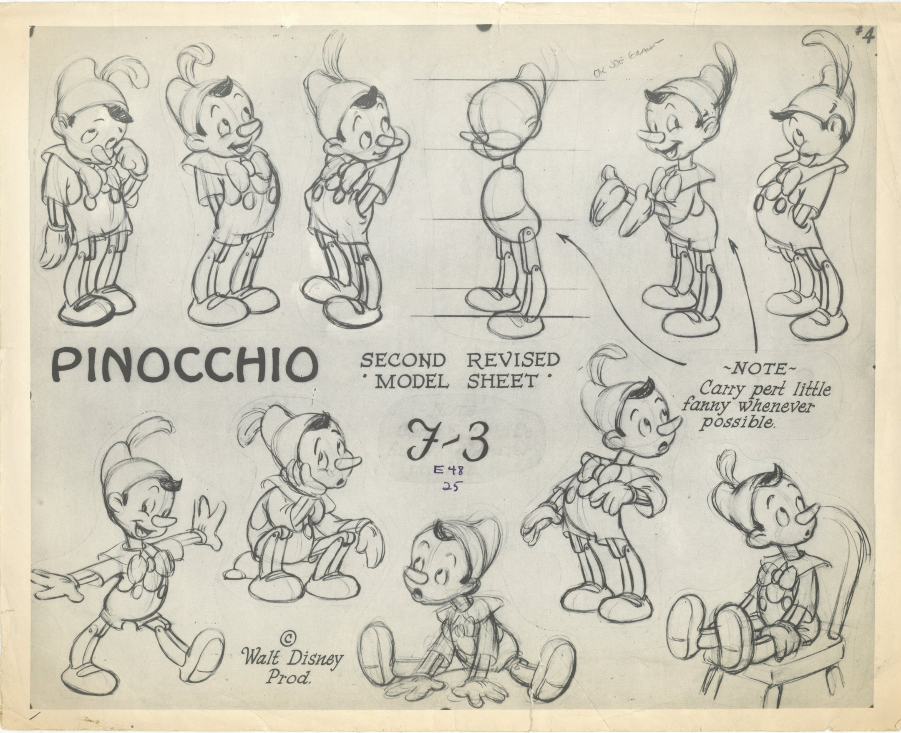

# The Linear Model

::: callout-important
## Who Cares?

Linear models are the foundation of much of statistics, and help scientists make predictions. Ultimately, a linear model is just a line, and in this chapter we'll learn how to use a line to do the following :

- Make predictions about one variable (the DV) from another (the IV).
- Quantify the amount of error in our predictions.
:::



# Part 1 : Making Predictions with Models

At the beginning of the semester, we talked about how the goal of social science is to make predictions about people, while recognizing that our predictions will not perfectly match what actually happens (which we call error).

Conceptually, we can think of a person's actual score on y (some variable) as the sum of our prediction and the error in our prediction (with the goal to minimize error as much as possible).

As an equation, we would write this as: `actual.score = our.prediction + error`

Great! But the real question is WHAT should define our prediction?

## RECAP : The Mean (and Linear Model) as Prediction

In Chapter 3, we learned how the mean was a simple way to make a prediction about individuals.

For example, if you wanted to know whether it would rain today, you might look at the average rainfall for today’s date, and use that average for your prediction.

Let's review this idea, and set up the linear model, by working with a classic dataset in teaching statistics - the Prestige dataset. These data are contained in the car package, and are used in one of the classic R textbooks - John Fox' Applied Regression Analysis and Generalized Linear Models (2nd Edition).

```{r}
# install.packages("car") # this installs a package - you only need to do this ONCE. Remove the # to run this code.
library(car) # loading the library - make sure you installed it first!
presto <- Prestige # creating a copy of the dataset so you don't mess something up :)
names(presto) # tadaa!!
```

You can read more about these variables by typing in ?Prestige to access the help page for the dataset. For this lecture, we'll be working with the variable prestige, which is a measure of how prestigious certain jobs were, in Canada, in the 1960s[^6r_linearmodels-1]. Note that individuals in this dataset are not people, but people's attitudes about types of jobs.

[^6r_linearmodels-1]: Super exciting! But remember this is like driving around a safe, boring parking lot!! We’ll hit the highway soon enough.

The graph to the right illustrates variation in this variable, as well as how the mean of prestige is the value that is closest to all the scores in the distribution.

The graph below [^6r_linearmodels-2] is defined by the following equation :

[^6r_linearmodels-2]: NOTE: Eagle eyed students may note something odd about the way the data are arranged on this graph - it looks like there's some quadratic (curved) pattern in the way the data are arranged. Because the x-axis for this graph (the index) is the row in which each data, all this quadratic pattern means is that more prestigious jobs tended to be listed earlier in the dataset than less prestigious jobs.

$\huge y_i = \hat{Y} + \epsilon_i$

```{r}
plot(presto$prestige)
abline(h = mean(presto$prestige), lwd = 5, col = 'red',
       xlab = "Index (Individual Row Number)",
       ylab = "Individual Prestige Score")
```

::: column-margin
**Here's a guide to what's in the equation and on the graph!**

$\Large y_i$ = the DV = the individual’s actual score we are trying to predict (remember $_i$ = index; a specific individual.)

- **on the graph:** each individual dot (on the y-axis; the x-axis just describes when people submitted the survey.

$\Large \hat{Y}$ = our prediction (the mean).

- **on the graph:** the solid red line

$\Large \epsilon$ = residual error = distance between the predicted values of y and the individual's actual value of y

- **on the graph:** the distance between each dot and the line.
:::

The equation is fancy way of saying that an individual's actual scores = our prediction (the mean) + error.

**The mean was a good starting place to make predictions for two reasons :**

1.  **By definition, the mean is the value that is closest to all the scores.** In other words, the mean minimizes the error in our predictions.

2.  **The mean is static (it does not change), meaning we can make the same prediction for every person.** This is a good place to start, but obviously there's a lot of error in our predictions. In fact, using our knowledge of residual errors, we can calculate this total (squared) error when we use the mean to make a prediction.

    ```{r}
    residual <- presto$prestige - mean(presto$prestige)
    sum(residual^2)
    ```

This value is the total sum of the squared residuals (also called the **sum of the squared errors** or often abbreviated **SST** when focused on the residuals of the mean.

**TLDR : we are interested in a variable (prestige), we can make pretty good predictions about prestige based on the mean (since by definition the mean is closest to all the scores in the data), and we are able to quantify how good our prediction is by calculating the sum of squared errors.**

Next, we'll try to improve upon our predictions of prestige.

## The Linear Model : It's Just a Line (With a Slope)

### Basic Concept.

The **linear model** is a simple, yet flexible, way to make predictions about one variable (the DV or y). There are many types of models, but most follow the same basic principles that we will review in this document. [The mean is actually a linear model in its simplest form : y \~ 1 + error, with 1 serving as a constant value (the mean!).]{.aside}

The mean is a great starting place, but it's limited because it's static - we have the same prediction for everyone in the dataset, when we know that people differ. So we will want to come up with predictions that change, depending on what we learn about another person.

**This principle of covariation** is a simple idea - if there's a pattern in how two things vary, then we can use information about one variable to make a prediction about what will happen for the other variable. This is what we talked about earlier in the semester when we discussed the idea of prediction - we're just formalizing this idea with numbers now.

As a conceptual example, there is variation in rain (some days it rains and some days it does not) and there is variation in clouds (bright skies some days; clouds other days). The ***covariation*** happens as I notice that on days when it rains (variable = rain), it also tends to be cloudy (variable = clouds). These two variables vary together (they "co-vary"). Of course, this pattern isn't always true - there's error.

I could write this as a model, where my predictions about whether it will rain will be influenced by whether I see clouds in the sky : `rain = clouds + error`

I would use this model to make an adjustment to my prediction when it rains - if there are clouds, I might think it's more likely that it will rain. That is, the presence of clouds ***changes my prediction.*** This change is a critical idea, and will be important to quanity - how large is the change? Does it improve my predictions?

As another example, think about how you would write an equation to model the idea that on days when it's raining, I tend to hear raindrops (and on days when it's not raining, I don't tend to hear raindrops). I might write this model as `rain = rain sounds + error`

These two models look similar, but are not equal. If I had to guess, I'd say that hearing rain is a better way to make predictions of rain than looking at the clouds, meaning there would be less error in my predictions. So not only do models use information about which variables you can use to make predictions about another, but they also tell you how much you should update your predictions about one variable from another.

### **Prestige Example**

Returning to our previous example, let's predict the variable prestige from the variable education - another continuous variable in the Prestige dataset. As a linear model, I would write this as : `prestige = education + error`

In the same way I could expect rain sounds to be related to rain, a job that requires more years of education might be related to how prestigious the job is. This is not true of all careers (consider the “high educated” poet ridiculed by society, perhaps, or the “low educated” firefighter revered by society[^6r_linearmodels-3].

[^6r_linearmodels-3]: And good to explore why we care about prestige in careers anyway? I blame capitalism and our society’s unwillingness to provide people with their basic needs, so a person's value is determined by how much their material conditions, and whether they can meet (or exceed) those basic needs. Anyway, point is firefighters and poets are both cool and important for society.

Let's graph these two variables side by side.

```{r}
par(mfrow = c(1,2)) # splits my graphing window
hist(presto$prestige, col = 'black', bor = 'white', main = "")
hist(presto$education, col = 'black', bor = 'white', main = "")
```

Great. So both prestige and education vary. Not every job has the same prestige, and not every job requires the same years of education.

The question is whether these two variables **covary**. Are changes in prestige related to changes in education??

**Pop Quiz: How can you see the relationship between prestige and education in the graphs above?**

::: {.callout-tip collapse = "true"}

You cannot!!! I'm guessing that some of you are thinking that because both distributions are slightly positively skewed, this means that there is some covariation between these variables. However, this is an example of patterns in randomness - we can't really tell whether there is covariation from these two separate graphs. Instead, we need a different kind of graph that explicitly draws a connection between these two separate variables. This is the scatterplot, which you will learn about below :)

:::

### The Scatterplot

In order to examine how these two variables covary (that is, how variation in education is related to variation in prestige), we need to use a scatterplot.

A scatterplot graphs individual scores in terms of one variable on the Y axis (the vertical line) and the other variable on the X axis (the horizontal line).

To graph a scatterplot, you can use the plot() function, and tell R to predict one variable (in this case prestige) from another (education).

Take a look at the graph below - what do you see?

```{r}
plot(prestige ~ education, data = presto)
```

Watch the video below for an explanation of what's going on in the graph.



To define the model (as I did in the video), we just need to use a few lines of code.

```{r}
mod <- lm(prestige ~ education, data = presto) # this defines the model, and then saves it to an object (called mod)
coef(mod) # this shows me the values of the model
```

The linear model is just another line that updates our predictions of one variable based on knowledge of another.

This line (in red, on the graph below) has the following equation :

$\huge y_i = a + b_1 * X_i + \epsilon_i$

```{r}
plot(prestige ~ education, data = presto, # plots the model again
     xlim = c(0, 16),  # changes my x-axis to range from 0 to 16
     ylim = c(-20,90)) # changes my y-axis to range from -15 to 90
abline(mod, col = 'red', lwd = 5) # this adds the line to my graph.
```

::: column-margin
$\Large y_i$ = the DV = each individual’s actual score on the dependent variable.

- on the graph: the value of each dot on the y-axis

$\Large a$ = the intercept = the starting place for our prediction. You can think of the intercept as "the predicted value of y when all x values are zero”.)

- on the graph : the value of the line at X = 0

$\Large X_i$ = the IV = the individual's actual score on the independent variable (a different variable than the DV).

- on the graph : the value of each dot on the x-axis

$\Large b_1$ = the slope = an adjustment we make in our prediction of y, based on the individual's x value.

- on the graph: how much the line increases in y value when x-values increase by 1 unit.

$\Large \epsilon_i$ = residual error = the distance between our prediction and the individual's actual y value.

- on the graph: the distance between each individual data point and the line.
:::

::: {.callout-note collapse="false"}
## [Check-In: Intercepts and Slopes](https://docs.google.com/forms/d/e/1FAIpQLSev3Ot9gGd9QcHpEh5GhWifCAA7c_A-ycKT-7Zg5orC3dtGlg/viewform?usp=sf_link)

**Test your understanding of linear models!** Use the Prestige dataset and R to predict the variable income (the DV) from the variable education (the IV). You can try to do this in R on your own computer, or use the output below. Use this model to answer the questions for this check-in in the link above.

```{r}
#| echo: false
lm(income ~ education, data = presto)
```
:::

# Part 2 : Evaluating Error in Predictions

Remember our goal is to make good predictions that have little error. So to evaluate the quality of our predictions, we need to evaluate how much residual error there is - the distance between each point and the line.

## Visualizing Residual Error in the Model

This is similar to what we did with the mean - we draw a line that is close to all the individual scores, and then calculate the sum of the squared errors. However, whereas the mean yields the same prediction for each individual (and the line is flat), the linear model yields a specific prediction for each individual's y score, based on the value of x (and the line has a slope).

Below are two graphs - the one on the left uses the mean to make predictions of prestige, and the one on the right uses education to make predictions of prestige (our model).

Look at the two graphs - can you tell which one has more (or less) residual error?

```{r}
par(mfrow = c(1,2))
plot(presto$prestige)
abline(h = mean(presto$prestige), lwd = 5, col = 'red')
plot(prestige ~ education, data = presto, # plots the model again
     xlim = c(0, 16),  # changes my x-axis to range from 0 to 16
     ylim = c(-20,90)) # changes my y-axis to range from -15 to 90
abline(mod, col = 'red', lwd = 5) # this adds the line to my graph.
```

Just by looking at two graphs, it’s clear that there’s less residual error when we use education to make predictions of prestige (vs. using the mean). In other words, the individual scores are further from the red line on the left graph than on the right graph.

## Calculating Residual Error in the Model

Still, we are going to want to calculate these differences to describe just how much better our predictions are. What makes this potentially more challenging is that when we use a model to make predictions for individual scores, we will predict a different value for each individual based on the result of our model. For example, a job that requires 6 years of education will have a different predicted value of prestige than a job that requires 7 years of education.

Fortunately, R does the hard work of making predictions for us, and even saves the residual errors as part of the model output.

For example, from our model where we predicted prestige from education:

```{r}
head(mod$residuals) # these are the residuals (the errors from our model)

head(mod$residuals^2) # these are the squared residuals

sum(mod$residuals^2) # these are the sum of the squared residuals when using the model to make predictions
```

Notice that the sum of the squared errors for this model, where we use education to predict prestige, is less than the sum of the squared errors from the model where we used the mean to make predictions.

In fact, we can calculate exactly how large this difference in errors is between the two predictions.

```{r}
SSM <- sum(mod$residuals^2) # saving the sum of the squared errors from the model
SST <- sum(residual^2) # saving the sum of the squared errors from the mean
SST - SSM # the difference in the squared errors from the mean vs. the model
```

This tells me that the model where we use education to predict prestige reduces the squared error by 21608.44. That is a large number! But it's hard to understand how large it is, because it's missing context.

To provide this number context, we can describe how large this reduction in residual error is, relative to the original residual error that we had when we used the mean to make predictions.

```{r}
(SST - SSM)/SST
```

This number (.72) means that using education to predict prestige explains 72% of the total variation in prestige (when you use the mean to make predictions). If this sounds like a large percentage, you would be right - there’s no “rule” about what counts as a large or little percentage of variation explained.

This statistic is called $R^2$ ("r-squared"), and is defined by the following equation.

$\Huge R^2 = \frac{SS_{total} - SS_{model}}{SS_{total}}$

What $R^2$ does is contextualize our reduction in error, by describing how much less error we have in our model, compared to the error that we had when using just the mean to make predictions.

- Another way to think of $R^2$ is that it describes the percentage of variation in the DV that our model is able to predict or explain.

- $R^2$ can range from 0 to 1. The closer to zero, the less our model improves upon predictions (because 0 = no difference between the error when using the mean to make predictions and the error when using the model to make predictions). The closer to one, the more our model improves upon predictions. An $R^2$ of 1 would mean that you are making perfect predictions. If this happens, you have probably done something wrong.

::: {.callout-note collapse="false"}
## [Check-In : Understanding $R^2$](https://docs.google.com/forms/d/e/1FAIpQLScaXZgOIYrWEUQdOS_vRq2UlMne8VHOvmfRYzSerpsamGP5Zg/viewform?usp=sf_link)

Here’s a super quick check-in on interpreting $R^2$ values!
:::

# Example : Age and Narcissism

## Practice Questions

**Remember our Narcissistic MBA students? They’re back, in Linear Model form! Practice working with linear models to answer the following questions.**

[Link to dataset](https://www.dropbox.com/scl/fi/iaq0xi3ewnbck6n7o13wr/hormone_dataset.csv?rlkey=tzk1q408c8hkfvc8omrssf3bq&dl=0)

1.  Is there a relationship between narcissism (DV = NPI) and age (IV = age)?

2.  What is the intercept of this linear model (and what does it tell you?)

3.  What is the slope of this linear model (and what does it tell you?)

4.  What is the predicted narcissism for someone who is 25 years old?

5.  What is the sum of the squared residual errors from this model (and what does this statistic tell you / mean?)

6.  What is the $R^2$ value of this linear model (and what does this statistic tell you?)

## Video Walk-through

**Try to answer the questions on your own before watching the video below.**



- [link to the R script I used for this video](https://www.dropbox.com/s/w7qi8v13vkp7tjp/linearmodel_NPIage.R?dl=0)
