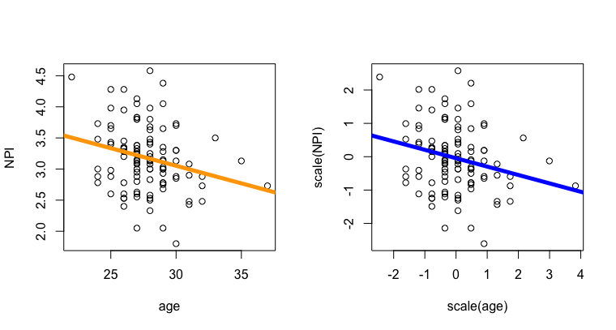
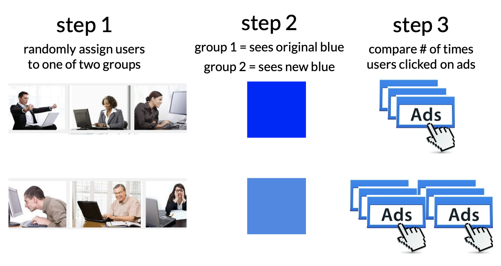

# More Levels and Experiments

## Part 1 : The Linear Model with a Categorical IV…with THREE+ Levels

In Chapter 7, we showed how the linear model could be adapted to predict a numeric DV when the IV was a categorical variable with two levels. And guess what? When the IV has more than three levels, we can use the same linear model. Hooray! The only difference is now you have multiple levels that differ from the intercept (or “reference group”).

Let's mix it up, and see if some good ol' fashioned YOUTUBE VIDEOS OF A DISEMBODIED VOICE can explain this.

```{r}
#| include: false
library(car)
library(gplots)

presto <- Prestige
```

### **Video 1 : Defining the Model with the lm() function**

- [**here’s a link to R Script (as used in the video)**](https://www.dropbox.com/scl/fi/zftlvmxn81onija9awafk/7_3LevelModelQuiz7.R?rlkey=5qxhanq64lbvmtya7du6ubypf&dl=0)



```{r}
par(mfrow = c(1,2))
hist(presto$prestige)
plot(presto$type)

mod <- lm(prestige ~ type, data = presto)
mod
```

### **Video 2 : Interpreting the Model**



#### **The Linear Model Equation:**

```{r}
coef(mod)
```

#### **Using the Equation and Dummy Coding to Generate Predicted Values**

+----------+-----------------+------------+----------+-------------------------+-----------------+
|          |                 |            |          |                         |                 |
+==========+=================+============+==========+=========================+=================+
|          | (the intercept) | X1         | X2       | Calculations            | Predicted Value |
|          |                 |            |          |                         |                 |
|          | **35.5**        | (typeprof) | (typewc) |                         |                 |
|          |                 |            |          |                         |                 |
|          |                 | **32.3**   | **6.7**  |                         |                 |
+----------+-----------------+------------+----------+-------------------------+-----------------+
| bc       | 1               | 0          | 0        | 35.5 + 32.3\*0 + 6.7\*0 | = 35.5          |
+----------+-----------------+------------+----------+-------------------------+-----------------+
| prof     | 1               | 1          | 0        | 35.5 + 32.3\*1 + 6.7\*0 | = 67.8          |
+----------+-----------------+------------+----------+-------------------------+-----------------+
| wc       | 1               | 0          | 1        | 35.5 + 32.3\*0 + 6.7\*1 | = 42.2          |
+----------+-----------------+------------+----------+-------------------------+-----------------+

#### **Yes, Professor, A Picture is Worth....1000 Words.**

```{r}
par(mfrow = c(1,2))
plot(presto$prestige, col = presto$type, pch = 19)
abline(h = coef(mod)[1] + coef(mod)[2], col = 'red', lwd = 5)
abline(h = coef(mod)[1] + coef(mod)[3], col = 'green', lwd = 5)
abline(h = coef(mod)[1], col = 'black', lwd = 5) # blue collar

plotmeans(prestige ~ type, data = presto, connect = FALSE)
```

### **Video 3 : Releveling the Variable**



```{r}
presto$typeR <- relevel(presto$type, ref = "prof")
mod2 <- lm(prestige ~ typeR, data = presto)
plotmeans(prestige ~ typeR, data = presto, connect = FALSE)
coef(mod2)
```

### **Video 4 :** $R^2$ **for a Categorical Model**



```{r}
par(mfrow = c(1,2))
plot(presto$prestige, main = "The Mean as Our Prediction")
abline(h = mean(presto$prestige), )

plot(presto$prestige, col = presto$type, pch = 19, main = "The Model (Job Type) As Our Prediction")
abline(h = coef(mod)[1] + coef(mod)[2], col = 'red', lwd = 5)
abline(h = coef(mod)[1] + coef(mod)[3], col = 'green', lwd = 5)
abline(h = coef(mod)[1], col = 'black', lwd = 5) # blue collar
```

## [**CHECK-IN TO ASSESS YOUR UNDERSTANDING HERE**](https://docs.google.com/forms/d/e/1FAIpQLScyhL8OaHrdnmFXc36O6czzfkK1h85ka-XqIV9hWrWjwv5I-A/viewform?usp=sf_link) **\[no r required\]**

# Part 3 : Interpreting Models with the Z-Score

::: {.callout-warning collapse="false"}
## RECAP : Uhhh…can you re-explain Z-Scoring Professor???

A z-score describes how far an individual score falls above and below the mean (a residual!) in units of standard deviation. Z-scores are used to help give context to data - how far above or below the average is an individual (their distance from the mean), compared to the standard deviation (the average amount that people differ from the mean).

Z-scores can also be useful when the units of measurement don’t have any meaning. For example, let’s say you take a job on Jeff Bezo’s Mars ™ and learn that a job pays 1298723 BezosBucks. Is this a little? A lot? Well, knowing that it’s 120 BezosBucks above the average income might give you some indication that you are going to be better off than others on Jeff Bezos’ Mars ™. But how much better off?

If you learn the standard deviation of income on Jeff Bezos’ Mars ™ is 12, then your above average salary is 10 times more than what you’d expect the average person to differ from the average salary - you are gonna be VERY RICH compared to the average resident - drinking fresh water and breathing air created by the finest asteroidoxygenators!

But if the standard deviation is 1200, then your z-score = .1, which means you are only a tenth of a standard deviation above average, which means that you will be lumped with the masses on Jeff Bezos’ Mars - slurping recycled air with the rest of us.
:::

## Why Z-Score in a Model

In a linear model, the slope describes the relationship between the two variables in whatever units the DV and the IV were measured in. So in our prestige example, the slope of 5.36 means that for every 1-unit increase in years of education, our prediction of prestige goes up by 5.36 points. Is that a little change in prestige? A lot? It’s hard to know, since prestige is not tangible, but a human-created construct.

Which brings us back to z-scores. If we z-score both the DV and the IV in our linear model, the (arbitrary) units of measurement disappear, and both variables are described in terms of standard deviation. This allows us to better relate each variable to another. To z-score the variables in a model, you just use the scale() function inside the linear model.

Click the tabs to switch between Raw Units and Z-Scored Units. What changes? What stays the same??

::: panel-tabset
### Linear Model in Raw Units

Here's the graph, in the original units of measurement.

```{r}
plot(prestige ~ education, data = presto, 
     ylab = "Prestige (Raw Units)",
     xlab = "Education (Years)") 
mod <- lm(prestige ~ education, data = presto)
abline(mod, lwd = 5, col = 'red')
```

And here's the result of the model.

```{r}
round(coef(mod), 2)
```

### Linear Model in Z-Scored Units

Here's the graph when the DV and IV are Z-Scored.

```{r}
plot(scale(prestige) ~ scale(education), data = presto, 
     ylab = "Prestige (Units of Standard Deviation)",
     xlab = "Education (Units of Standard Deviation)") 
zmod <- lm(scale(prestige) ~ scale(education), data = presto)
abline(zmod, lwd = 5, col = 'red')
```

And here's the result of the model.

```{r}
round(coef(zmod), 2)
```
:::

### Interpretation of Z-Scores

As before, the data do not change - the only thing that changes are the units in which the DV and IV are measured (and thus the units of the intercept and slope). 

- **The intercept of a z-scored model will always be zero (or something very near zero).** Remember that a z-score of zero means average, and the intercept is defined as “the predicted value of the DV when all IVs are zero.” This means that….

  - …the predicted value of the DV is zero when the IV is zero.

  - …someone with the average IV (IV = z-score of zero) is predicted to have the average DV (DV = z-score of zero), or 

- **The slope of a z-scored model describes the relationship between the variables in units of standard deviation.** When both the DV and IV share the same units of measurement, the slope becomes a lot more informative, since it tells you exactly how linked the two variables are. Knowing that for every 1-unit increase in years of education, the predicted prestige goes up by 5.36 (the slope) makes far less sense to me than knowing that for every standard deviation increase in years of education, the predicted prestige goes up by .85.

  - The maximum slope of a z-scored linear model (with one IV) is 1 (one). This would be a perfect positive relationship, where a one standard deviation increase in the IV is equal to a one standard deviation increase in the DV. 

  - The minimum slope of a z-scored linear model (with one IV) is -1 (negative one). This would be a perfect negative relationship, where a one standard deviation increase in the IV is equal to a one standard deviation decrease in the DV. 

  - A slope of zero would mean that there’s no relationship between the two variables.

  - Wait a minute…that’s….CORRELATION COEFFICIENT’S MUSIC.

Yes, class, a correlation - the relationship between two variables, is just the standardized (z-scored) slope of a linear model (with one IV).

```{r}
cor(presto$prestige, presto$education) # the correlation
coef(zmod)[2] # the slope of our z-scored model
```

See the video below for another example.

### Video Example : Age and Narcissism (Z-Scored)

 The video above walks through z-scoring in another example, from the narcissism dataset.

{fig-align="center"}

## [CHECK-OUT : Understanding Z-Scores and this Chapter! Document](https://docs.google.com/forms/d/e/1FAIpQLSdpzsYEijsSkaG_gRA4Pmqg1QFGWmTSUUmR8B31cYNtms6jtw/viewform?usp=sf_link)

# Part 3 : Experimental Methods

Last chapter, we learned the “four reasons” why you might find a “pattern in the data” (another way of saying why “correlation does not equal causation”. However, scientists and psychologists often want (or need) to establish causation, and an experiment is the “gold standard” approach for how to do this.

Scientists and psychologists often want (or need) to establish causation, and an experiment is the “gold standard” approach for how to do this.

I’m guessing y’all have learned about experiments in many other classes, so won’t spend pages and pages and pages going over it again here.[^9r_modelextensions-1]

[^9r_modelextensions-1]: I'll just spend pages going over it. Hah hah.

**Here’s a [supplemental chapter on experiments](https://kpu.pressbooks.pub/psychmethods4e/part/experimental-research/) that reviews some key terms you should be familiar with :** experimental manipulation; extraneous variables as “noise”; random assignment; placebo effects; external validity; construct validity; experimenter expectancy effects.

### The Definition of Causality

1.  The cause and effect are contiguous in space and time.
2.  The cause must be prior to the effect. (no reverse causation)
3.  There must be a constant union betwixt the cause and effect. (“Tis chiefly this quality, that constitutes the relation.”) (no random chance)
4.  The same cause always produces the same effect, and the same effect never arises but from the same cause. (not "just" some third variable) \[\^1\]

\[\^1\] but remember, life is complex and there are often multiple causes of human behavior!

### The Google Experiment

When I worked at Google as an intern for one summer[^9r_modelextensions-2], corporate PR told a story about their "data driven approach", where no decision was left to mere chance. Even something as simple as the color font they used could be the focus of an analytic research question.

[^9r_modelextensions-2]: well-fed; gratuitously paid; soul-drained. I was in their "People Operations" (/HR) department, helping them set up longitudinal surveys and do various other research projects on compensation, appreciation, and diversity that helped feed the corporate beast.

+------------------------------------------+-----------------------------------------+
|                                          |                                         |
+==========================================+=========================================+
| **Google Homepage : Before Experiments** | **Google Homepage : After Experiments** |
+------------------------------------------+-----------------------------------------+
|                    |                  |
+------------------------------------------+-----------------------------------------+

Watch the video below. You can [read more about this study here](https://www.theguardian.com/technology/2014/feb/05/why-google-engineers-designers).



{fig-align="center"}

**Then, see if you can identify the different parts of an experiment.**

- **linear model :** DV \~ IV (what was manipulated) + confound variables + error

- **manipulation :** what were the treatment and control groups?

- **random assignment :** how were confound variables balanced across conditions?

- **double-blind :** did the study avoid demand characteristics & placebo effects?

- **generalizability :** did the study have external validity? what was the effect size (R2)?

- **ethics :** should researchers do this type of study \[predict & control\]

::: {.callout-tip collapse="true"}
### Answers to Google Shade of Blue Experiment

- **linear model** : number of ads that peopled clicked on \~ shade of blue people saw + age + location + income + education + media literacy + relevance of the ad + etc + error

- **manipulation :** “control” group = shade of blue (existing shade of blue); treatment group = shade of blue.

- **random assignment :** participants were randomly assigned to see links in one shade of blue or another. because this was randomly assigned, all the other differences between people (those variables that might affect the DV, such as age or location) are “balanced out”.

- **double-blind :** the participant didn’t know that google was manipulating the shade of blue to get them to click on ads. the website (google) doesn’t know whats going on.

- **generalizability :** yes, high external validity! Google was changing its own website. an example of low external validity would be printing out a sheet with different shades of blue that users “click” on with their finger.

- **ethics :** WOULD LOVE TO HEAR FROM Y’ALL : do you think it’s ethical for companies like Google to do this research???
:::

# Part 4 : Regression Assumptions

The interpretation of our linear models depends on a variety of different assumptions being met. You can read more about these from the great [Gelman & Hill's textbook : Data Analysis Using Regression](https://www.dropbox.com/scl/fi/iuhs0x2un3d4ivhcc3rug/Gelman_Hill_RegressionAssumptions.pdf?rlkey=blhc8bcxypu0ar5wvzpruslqk&dl=0). But below is a TLDR, with a few ideas of my own thrown in.

*AUTHOR'S NOTE : this is a pretty incomplete part of the textbook; could probably use a few examples. on the very long to-do list!*

1.  **Validity.** Is your linear model the right model to answer the research question that you have? This is the big question, and often goes beyond the specific statistics that we are focusing on. Did you include the right variables in your model, or are you leaving something out? Are you studying the right sample of people, drawn from the right population? Are your measures valid? This is hard to do, and good to remember that it is hard so you ask yourself "am I doing a good job"?

2.  **Reliability of Measures.** The variables in your linear model should be measured with low error (“garbage in, garbage out”). There are different ways to assess reliability.

    - **Cronbach's alpha** (`psych::alpha()`) is good for assessing the inter-item reliability of a likert scale.

    - **The Intraclass Correlation Coefficient (ICC)** is often used for observational ratings where multiple judges form impressions of the same target.

    - **Test-retest reliability** is a great way to ensure that physiological or single-item measures will yield repeatable measures over time (assuming the target of measurement has not changed between time points). One way to test this is to define a linear model to predict the measure at one time point from the measure at another; you'd expect to see a strong relationship.

3.  **Independence.** This is a big one - the residuals in your model need to be unrelated to each other. That is, I should not be able to predict the value of one error from another error. When the data in a linear model come from distinct individuals who are unrelated to each other, this assumption is usually considered to be met. However, there are often types of studies where the data are not independent.

    - **Nested Data :** Often times, individuals in a dataset belong to a group where there's a clear dependence. For example, the happiness of individual members of a family is probably dependent on one another (since they share the same environment, stressors, etc.); the test-scores of children in a school are probably all related to each other (since they share the same teachers, administrators, funding, lead exposure in the drinking water, etc.)

    - **Repeated Measures :** If a person is measured multiple times, then their data at one time point will be related to their data at the second time point, since they are coming from the same person, with the same past experiences and beliefs and genetics and all that other good stuff.

    If the data are not independent, then we will need to account for the dependence in the data. We will learn to do this when we review Multilevel Linear Models. (Spoiler : it's more lines.)

4.  **Linearity.** The dependent (outcome) variable should be the result of one or more linear functions (slopes). In other words, the outcome is the result of a bunch of straight lines. If the straight lines don't properly "fit" or "explain" your data, then maybe you need some non-straight lines...you could bend the line (add a quadratic term), look for an interaction term (that tests whether there's a multiplicative relationship between the variables), or apply a non-linear transformation to the data (i.e., often times income is log transformed, since a 9,000 point difference between 1000 and 10,000 dollars/month is not the same as a 9,000 point difference between 1,000,000 and 1,009,000 dollars/month).

5.  **Equal Variance of Errors (Homoscedasticity).** The errors associated with the predicted values of the DV (the residuals) should be similar for all different values of the IV. Homoscedasticity means that the residual errors in our outcome variable are distributed the same across the different values of the IV. Heteroscedasticity means there is some non-constant variability in errors, which means that your model may not be an appropriate explanation of the data.

6.  **Normality of Errors (Residuals and Sampling).** This assumption is less emphasized as our datasets have gotten larger, and methods for estimating sampling error have improved. But the basic idea is that statistics like confidence intervals and estimates of slopes assume that the errors in our model are normally distributed. If they are not, it's likely that your model is not appropriately fitting the data (i.e., maybe some outliers are influencing the results.)

### Testing Assumptions in R

Assumptions 1-3 require critical thinking about your methods and measures.

Assumptions 4 and 5 can be examined using the plot() function in base R - you may have accidentally come across these when trying to graph your linear model.

We talked about how to interpret these plots a little in lecture; here's [another tutorial](https://library.virginia.edu/data/articles/diagnostic-plots) that walks through the interpretation. Let us know (on Discord!) if you find another good example / explanation.

```{r}
par(mfrow = c(2,2))
plot(mod)
```

Assumption 6 can be examined by graphing the residuals of your model object with a histogram.

```{r}
par(mfrow = c(1,1))
hist(mod$residuals)
```
